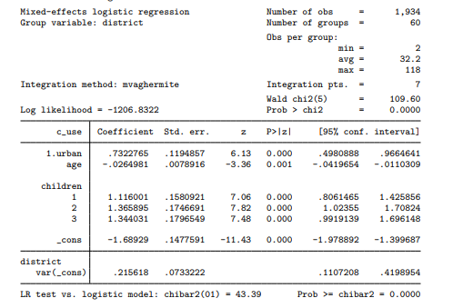
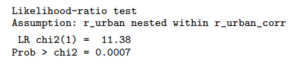
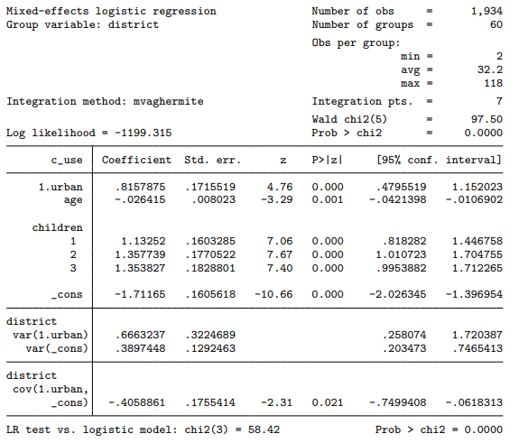

```{r setup, include=FALSE}
knitr::opts_chunk$set(echo = TRUE)

```


__TÍTULO:__ Fatores associados à evasão e conclusão de curso na UFRJ: análise de heterogeneidade

__PESQUISADORA:__ Melina Klitzke Martins
  
__ORIENTADOR:__ Rosana Heringer, Flávio Carvalhaes

__INSTITUIÇÃO:__ Universidade Federal do Rio de Janeiro

__FINALIDADE DO PROJETO:__ Doutorado

__PARTICIPANTES DA ENTREVISTA:__ 

- Melina Klitzke Martins
- Flávio Carvalhaes
- Monica Carneiro Sandoval 
- Denise Aparecida Botter
- Viviana Giampaoli
- Giovanna Vilar
- Mariana Almeida
- Renata Hirota

__DATA:__ 23/04/2020

__FINALIDADE DA CONSULTA:__ Consultoria sobre o modelo logístico multinível; 
auxílio na validação e interpretação do modelo

__RELATÓRIO ELABORADO POR:__ 
  
- Giovanna Vilar
- Mariana Almeida
- Renata Hirota  

\newpage

# 1. Introdução

A evasão dos alunos no ensino superior é uma situação recorrente e estudada por
diversos autores no campo da educação e das ciências sociais. Em suma, como as
variações  nos ambientes acadêmicos moldam as experiências e os resultados dos
alunos de diferentes  maneiras, as disparidades entre as distribuições dos
estudantes em todas as áreas de estudo, ainda  que pequenas, podem contribuir 
para entender as desigualdades de resultados quanto à evasão de curso.

A partir de um estudo observacional, a pesquisa busca analisar quais são os 
fatores associados à evasão de curso na UFRJ e como os efeitos desses fatores 
variam entre cursos. 

A metodologia utilizada pela pesquisadora é um modelo logístico multinível
(hierárquico), em que as variáveis de nível 1 são relacionadas às 
características dos estudantes e as variáveis de nível 2 são relacionadas aos
cursos. A pesquisadora busca com a entrevista uma consultoria sobre o modelo
logístico multinível e auxílio na validação e interpretação do modelo.


# 2. Descrição do estudo

Os dados foram analisados a partir de um modelo logístico multinível 
(hierárquico), em que as variáveis de nível 1 são relacionadas às 
características dos estudantes e as variáveis de nível 2 são relacionadas aos
cursos. 

As unidades amostrais da pesquisa são os ingressantes no primeiro semestre do 
ano de 2014, somando um total de 4.480 observações. Todos esses alunos foram
acompanhados até o primeiro semestre de 2019 (1 ano e meio após o perído de 
formação ideal). Apesar de serem dados longitudinais, como informado pela 
pesquisadora, tal característica não é considerada nesta etapa do estudo, 
uma vez que o estudo do tempo de evasão já foi realizado pela pesquisadora e 
não é objeto de pesquisa dessa análise.

A pesquisadora selecionou todos os cursos de modalidade presencial ofertados 
pela UFRJ e, a partir da volumetria, agrupou-os de acordo com o tipo de curso. 
Por exemplo, cursos como Letras-Espanhol, Letras-Inglês e Letras-Português foram
agrupados em um mesmo bloco. Ao fim desse agrupamento, foram obtidos 45 clusters
contendo, no mínimo, 30 observações. É importante ressaltar que o curso de 
Medicina foi excluído da análise por não ser possível observar a conclusão de
curso desses ingressantes, já que sua duração ideal ultrapassa o tempo de
acompanhamento. Além disso, outro argumento a favor da exclusão apontado pela
pesquisa é a baixa taxa de evasão observada no curso.


# 3. Descrição de um Modelo Multinível

A forma generalizada de um modelo multínivel pode ser definido da seguinte forma:

$$ logit (\pi_{ij}) = \beta_{0j}+\sum_{k}^{m}{ \beta_{kj}*X_{kij}} + \epsilon_{ij} \quad \text{(Nível 1)} $$ 
com $$ \beta_{0j} = \gamma_{00} + \sum_{a}^{h}{\gamma_{0a}}*Z_{aj} + u_{0j} \quad \text{(Nível 2)}$$  
 e   $$ \beta_{kj} = \gamma_{k0} + \sum_{a}^{h}{\gamma_{ka}}*Z_{aj} + u_{kj}\quad \text{(Nível 2)}$$

para $j = 1,...,n$ clusters de cursos, $i = 1,..., n_{j}$ alunos no $j$-ésimo cluster, $k = 1,...,m$ variáveis independentes de nível 1 e $a = 1,...,h$ variáveis independentes de nível 2.  

$u_{0j}$ é o efeito aleatório do $j$-ésimo cluster que compõe o intercepto, cuja 
distribuição segue uma N(0,$\sigma^{2}_{u_{0j}}$). 

$u_{kj}$ são os efeitos aleatórios da $k$-ésima variável de nível 1 no $j$-ésimo cluster e cuja distribuição segue uma N(0,$\sigma^{2}_{u_{kj}}$).

Os erros $\epsilon_{ij}$ são independentes dos efeitos aleatórios mas não são independentes entre eles, ou seja, há uma dependência entre as observações agrupadas dentro de cada um dos clusters.

Os $X_{kij}$ são as variáveis independentes de nível 1 utilizadas no modelo enquanto $Z_{aj}$ são as variáveis a nível de cluster (nível 2).  

$\gamma_{00}$ e os $\gamma_{k0}$ são os coeficientes relativos ao intercepto da regressão associada às variáveis explicativas do nível 2. Já $\gamma_{0a}$ e os $\gamma_{ka}$ são os coeficientes relativos à inclinação da regressão associada às variáveis explicativas do nível 2.

Nota-se que os interceptos $\beta_{0j}$ e os $\beta_{k0}$ variam de cluster para cluster, pois foram incluídos efeitos aleatórios em todas as variáveis.


Um modelo multinível mais simples -- consequentemente muito utilizado -- é o modelo com intercepto aleatório e sem variáveis de segundo nível descrito a seguir:

$$ logit (\pi_{ij}) = \beta_{0j} + \sum_{k}^{m}{ \beta_{k}*X_{kij}} + \epsilon_{ij} \quad \text{(Nível 1)} $$  
com $$ \beta_{0j} = \beta_{0} + u_{0j} \quad \text{(Nível 2)}  $$

para $j = 1,...,n$ clusters de cursos, $i = 1,..., n_{j}$ alunos no $j$-ésimo cluster, e $k = 1,...,m$ variáveis independentes no modelo.

$u_{0j}$ é o efeito aleatório que compõe o intercepto do j-ésimo cluster, cuja 
distribuição segue uma N(0,$\sigma^{2}_{u_{0j}}$). Ressaltamos que $\beta_{0}$ é o efeito fixo do intercepto do modelo.

Os $X_{kij}$ são as variáveis independentes de primeiro nível utilizadas no modelo e os 
coeficientes $\beta_k$ são os coeficientes fixos do modelo. 

Os erros $\epsilon_{ij}$ são independentes de $u_{0j}$.

É importante destacar que componentes aleatórios podem ser acrescentados aos 
coeficientes das variáveis independentes, como descrito no modelo geral.
  
Nesse caso, nota-se que os interceptos variam de cluster para cluster (considera-se que possa existir diferenças entre os clusters), mas os $\beta_{k}$ são constantes para todos os clusters. 


# 4. Descrição das variáveis e processo de coleta de dados

## 4.1 Base de dados 

A base de dados utilizada foi construída a partir dos microdados da coorte
fornecidos pela Divisão de Registro de Estudante (DRE/Pr1) da UFRJ. A maioria 
das informações são coletadas através de questionário socioeconômico, produzido 
e aplicado pela instituição no ato da pré-matrícula do estudante. 
O alto índice de respostas deve-se, possivelmente, ao fato de que o estudante
precisa apresentar o comprovante da realização da pré-matrícula, exigido no ato 
de confirmação da matrícula presencial. 

O questionário é composto por questões que abordam, entre outras informações,
aspectos socioeconômicos, culturais, escolares, de composição familiar e de 
escolha e expectativas sobre o curso e sobre a instituição.

## 4.2 Variáveis

A variável dependente (resposta) utilizada nessa análise é a evasão do curso no
primeiro ano  (1° e 2° semestre), representada por 0 e 1 (0 = não evadiu; 1 =
evadiu). O conceito de evasão aqui utilizado é o de evasão do curso, que é 
aquela em que o aluno deixa o curso de origem por qualquer razão (LOBO, 2012). 
Essa variável leva em conta a situação de matrícula do aluno em cada semestre: 
ativa, trancada, cancelada ou cancelada por conclusão de curso. Apenas aqueles 
que tiveram suas matrículas no curso canceladas (exceto o cancelamento por 
conclusão de curso) foram considerados como alunos evadidos.

Em um estudo multinível as variáveis independentes são classificados em dois 
tipos: variáveis de nível 1 e variáveis de nível 2. Neste caso, as variáveis de
nível 1 são as relacionadas aos estudantes:  
  
- Cor/Raça (0 = brancos e 1 = pretos e pardos);
- Sexo (0 = feminino e 1 = masculino);
- Status socioeconômico da família (SES), mensurado pela maior escolaridade do
pai ou da mãe (0 = menos que o ensino superior e 1 = ensino superior);
- Nota do ENEM no ano de entrada;
- Variável que diz respeito à questão "se foi a primeira opção de curso" (0 = 
sim; 1 = não);
- Variável que diz respeito à questão "se a nota de corte influenciou na escolha
do curso" (0 = não; 1 = sim);
- Coeficiente de Rendimento acumulado por semestre (CRa), relacionado ao último
semestre acompanhado.
  
No nível 2 (relacionadas ao cluster), inicialmente a pesquisadora criou uma 
variável de seletividade de curso utilizando a nota mediana do curso no Enem com
a seguinte regra: se a nota mediana do curso no Enem era maior que a nota mediana
geral no Enem, ou seja, de toda UFRJ, o curso é mais seletivo. Caso contrário, o
curso é classificado como menos seletivo.
  
- Seletividade (0 = menos seletivo; 1 = mais seletivo)
  
Os dados originais estão armazenados em Excel e o modelo foi construído no 
software `Stata`

# 5. Situação do Projeto 

O projeto encontra-se na fase de testes dos modelos multiníveis. Após a 
entrevista com a pesquisadora, foram feitas algumas sugestões à análise já 
realizada cujo modelo testado incluia um intercepto com efeito aleatório e 
apenas uma variável no nível 2.

Primeiramente, variáveis de nível 1 que podem ser estaticamente significantes 
foram excluídas do modelo testado. Anteriormente, um modelo de sobrevivência foi
construído e seus resultados foram utilizados para determinar as variáveis a 
serem incluídas nesta fase do estudo.

Salientamos que essa não é uma tomada de decisão correta pois variáveis que não 
se mostraram significantes na primeira etapa podem ser importantes na 
determinação do modelo multinível. São momentos e modelos diferentes, logo, 
todas as variáveis que a pesquisadora acredita afetar a evasão do curso devem 
ser testadas.

Além disso, as variáveis contínuas -- nota do ENEM e CRa -- possuem magnitudes 
muito distintas. O CRa é uma nota que varia de 0 a 10, enquanto que as notas do 
ENEM estão em uma escala de 0 a 1000. Essa diferença entre as escalas pode
desencadear erros de convergência durante os testes no software.

# 6. Conclusão e respostas às perguntas da pesquisadora

De forma geral, o projeto está em um estado bastante avançado, de forma que os
comentários a seguir se referem principalmente ao modelo escolhido pela 
pesquisadora e sugestões para melhorar a análise. Os comentários foram divididos
em seções tentando seguir uma ordem de precedência dos passos na análise 
estatística.

## 6.1 Sugestões sobre as variáveis

### 6.1.1 Inclusão de variáveis

A primeira sugestão oferecida é incluir no modelo todas as variáveis com bom
preenchimento (sem grande volumetria de dados faltantes) que a pesquisadora 
acredita ter algum efeito na evasão do curso. Durante os testes dos modelos, 
algumas podem se mostrar significantes e outras não, porém, é importante 
testá-las.

Além disso, também sugerimos o acréscimo de variáveis no 
nível 2. Por exemplo, o comportamento de evasão dos alunos parece ser diferente
entre as áreas do conhecimento (Humanas, Exatas e Biológicas), logo, seria
interessante construir essa variável categórica de curso.  

A seguir, incluímos uma lista de variáveis que podem ser incluídas no estudo:  
  
- Renda Familiar, _Nível 1_;
- Área do conhecimento do curso, _Nível 2_ (Humanas, Exatas e Biológicas); 
- Média da nota no ENEM do curso, _Nível 2_;
- Média do CRa do curso, _Nível 2_.

### 6.1.2 Uniformização na escala das variáveis

Destacamos a importância de uniformizar as variáveis contínuas referentes à nota 
do ENEM, pois, como explicado anteriormente, as magnitudes distintas entre os 
valores da variável CRa e os valores da variável nota do ENEM podem interferir 
na convergência matemática. 

Sugerimos que os valores da variável de nota sejam transformados em números na
escala de 0 a 10, a mesma utilizada no coeficiente de rendimento acumulado por
semestre.

Pontuamos também que não há um consenso na literatura quando se fala de 
padronizar variáveis em modelos multiníveis, e portanto a necessidade de 
padronizar está  relacionada com a interpretação da variável em todos os seus 
níveis (como há interesse em analisar os resultados com as variáveis CRa e nota 
do ENEM no nível zero, não há necessidade de padroziná-las, uma vez que a 
interpretação será outra).

## 6.2 Construção do modelo 

Quando construímos um modelo é sempre necessário checar a eficácia do mesmo. 
Além disso, precisa-se utilizar uma métrica para comparar diferentes modelos e
encontrar qual o melhor para o conjunto de dados. Assim, esse tópico foca em
apresentar medidas de desempenho para o ajuste da regressão logística 
multinível. Destacamos que, de acordo com a literatura, o nível de 
significância estátistica selecionado para testar as variáveis será de: 
p-valor < 0.05. 
A seguir, montamos um roteiro para essa etapa.

__Passo 0__: Definir se o modelo terá efeito aleatório apenas no intecepto ou se 
apresentará efeito aleatório em outras variáveis. Sugerimos começar com um modelo do primeiro tipo e depois testar outras versões caso faça sentido para o estudo;

__Passo 1__: Ajuste do modelo sem variáveis independentes (modelo nulo) para
calcular o coeficiente de correlação intraclasse (definido na seção 6.5) e interpretar a variação entre os clusters;
  
__Passo 2__: Incluir todas as variáveis independentes e observar a significância de cada uma. Excluir as que apresentarem p-valor > 0.05 e testar novamente o modelo;

__Passo 3__: Repetir o passo anterior até que não haja mais variáveis não significativas no modelo. Esse será o modelo final analisado.

Seguindo os passos anteriores, a pesquisadora pode construir duas linhas de modelos diferentes, um apenas com intecepto aleatório e outro com efeito aleatório no intercepto e em alguma variável de interesse, e depois compará-los através de uma medida estatística. Ela também pode comparar um modelo sem variáveis de nível 2 e outro com variáveis de nível 2, ou comparar variações de modelos com a mesma estrutura.

De forma geral, caso esteja em dúvida entre modelos, pode-se realizar um teste de razão de verossimilhança para compará-los. 

Como exemplo, deixamos descrito o teste entre um modelo $A_1$ e um modelo reduzido $A_0$ do mesmo (um caso com menos parâmetros). A hipótese de comparação é dada a seguir junto com a definição da estatística _deviance_ utilizada:

$H_0$ : O modelo mais simples $A_0$ se ajusta tão bem quanto o modelo $A_1$ 

$H_1$ : O modelo $A_1$ se ajusta significativamente melhor que o modelo mais simples $A_0$

$$ Deviance = -2 ln(likelihood_0) - [-2ln(likelihood_1)] \backsim \tilde{\chi}^2_{l} $$

em que $likelihood_0$ é a verossimilhança do modelo reduzido $A_0$ e $likelihood_1$ é a verossimilhança do modelo $A_1$. O _deviance_ tem distribuição qui-quadrado com graus de liberdade ($l$) igual à diferença do número de parâmetros em cada modelo. Se o p-valor < 0.05, então há indicíos para rejeitar $H_0$, ou seja, o modelo mais simples não parece se ajustar tão bem quanto o modelo $A_1$. 

O software `Stata` apresenta na parte superior da saída (log likelihood) o log da
verossimilhança do modelo testado ($ln (likelihood_{*})$). 
A função __lrteste modelo_1 modelo_2__ realiza o teste de verossimilhança no software.
 
Salientamos que nessa etapa é importante testar modelos com conjuntos diferentes de variáveis, entendendo quais fazem sentido para o estudo. Além disso, a medida _deviance_ é usada para sugerir alguns modelos “melhores”, mas o pesquisador é responsável por selecionar aquele que considera mais alinhado com a teoria e literatura da área.

## 6.3 Diagnóstico e Qualidade do ajuste

Após encontrar o modelo final é importante avaliar se o mesmo é eficiente para descrever a relação entre as variáveis independentes e a variável dependente. Assim, devemos verificar se os pressupostos do modelo foram respeitados.

Usando como exemplo o modelo com intercepto aleatório, podemos avaliar o ajuste do modelo realizando uma análise dos efeitos aleatórios através de um gráfico dos efeitos estimados (as estimativas de $u_{0j}$) padronizados (ou estudentizados) e os quantis da distribuição teórica normal. Idealmente, as estimativas dos efeitos aleatórios dos clusters coincidem com os quantis, formando uma linha reta diagonal pois eles seguem a distribuição determinada.

Em outras palavras, para verificar o pressuposto de normalidade do efeito aleatório do cluster, pode-se verificar se os os valores preditos dos efeitos aleatórios padronizados (ou estudentizados) são aproximadamente normais. O gráfico deverá apresentar no eixo x os quantis teóricos da distribuição normal, em relação às estimativas no eixo y.

Do ponto de vista do nível 1 (estudantes), deve-se observar no diagnóstico do modelo
se a função estimada é monotônica e se tem forma sigmoidal, através de um gráfico de resíduos do nível estudantes ($\epsilon_{ij}$) no eixo y e as observações no eixo x.
 
Um modelo vai parecer não ter se ajustado bem quando os pressupostos anteriores não parecerem ser respeitados. Além disso, os testes na seção 6.2 também são formas de avaliar os modelos

Salientamos que, caso exista mais de um efeito aleatório no modelo -- como em (1) -- todos os $u_{kj}$ devem ser analisados graficamente para entender se eles respeitam o pressuposto de distribuição normal.


## 6.4 Interpretação do modelo

Na regressão logística de efeitos mistos, os coeficientes fixos têm uma
interpretação condicional aos efeitos aleatórios. No caso do estudo analisado, 
as interpretações estão condicionadas aos clusters. O exemplo a seguir, extraído
do manual do `Stata`, ilustra como o modelo pode ser interpretado a partir da 
saída do software.

__Exemplo (1)__:  

Ng et al. (2006) analisam uma subamostra de dados da pesquisa de fertilidade de
Bangladesh de 1989 (Huq e Cleland 1990), que entrevistou 1.934 mulheres de
Bangladesh sobre o uso de anticoncepcionais. As mulheres na amostra pertenciam a
60 distritos, identificadas pela variável `district`. Cada distrito continha 
áreas urbanas ou rurais (variável urban) ou ambas, mas cada mulher reside em apenas uma das duas zonas. A variável `c_use` é a resposta binária, com um valor de 1 indicando o uso de anticoncepcionais. Outras covariáveis incluem idade centrada na média e uma variável categorizada para o número de filhos. A idade foi centralizada por escolha dos pesquisadores do artigo, uma vez que a variável Idade igual a zero não traz informação relevante (mulheres
com 0 anos não tomam anticoncepcionais, nem participaram da pesquisa, logo o 
intercepto dessa variável não seria interpretável).

```{r echo=FALSE}
df <- data.frame('Variável' = c('c_use','district','urban','age','children 1','children 2','children 3'),
             'Label' = c('Usa Contraceptivo = 1','Distrito','Urbano ou Rural','Idade Centralizada','1 filho = 1','2 filhos = 1','3 filhos = 1')) 
knitr::kable(df)
```

Considere um modelo de regressão logística hierárquico:
  
$$ log (\frac{\pi_{ij}}{1-\pi_{ij}}) = (\beta_0 +u_{0j})+ \beta_1*1.urban_{ij} + \beta_2*age_{ij} + \beta_3*1.children_{ij} + \beta_4*2.children_{ij} + \beta_5*3.children_{ij} $$
  
para $j = 1,...,60$ distritos, com $i = 1,..., n_{j}$ mulheres no $j$-ésimo distrito.

$u_{0j}$ é o efeito aleatório do intercepto cuja distribuição segue uma N(0,$\sigma^2_{u_{0j}}$).

Já os coeficientes $\beta_0$,$\beta_1$,$\beta_2$,$\beta_3$,$\beta_4$ e $\beta_5$ são os efeitos fixos do modelo enquanto $\pi_{ij}$ é a probabilidade do indíviduo $i$ no cluster $j$ apresentar resposta positiva (=1)

Nota-se que os interceptos variam de distrito para distrito (considera-se que possa existir diferenças entre eles), mas $\beta_1$,$\beta_2$,$\beta_3$,$\beta_4$ e $\beta_5$ são constantes para todos os clusters. Caso seja incluído outro efeito aleatório em alguma das variáveis, as inclinações relacionadas a essa variável também irão variar de distrito para distrito.

No software `Stata` a equação é dada por:  

__`melogit c_use i.urban age i.children || district:`__

Abaixo incluímos uma tabela das estimativas de efeitos fixos. As estimativas
representam os coeficientes de regressão, estes não são padronizados e estão na
escala logit. As estimativas são seguidas por seus erros padrão (SEs), p-valor e
intervalos de confiança.

O teste de razão de verossimilhança (LR) testa a hipótese nula de que o modelo construído
-- efeitos mistos -- fornece a mesma qualidade de ajuste de um modelo de regressão logística fixo. Se a hipótese nula é rejeitada, existem evidências de que o modelo com efeito aleatório de cluster se ajusta melhor do que o modelo sem esse efeito.

Como p-valor < 0.001, há indícios para rejeitar a hipótese nula e, assim, utilizar o modelo misto.

Caso o p-valor não fosse significante, entenderíamos que não há necessidade de aplicar um modelo com efeitos aleatórios, ou seja, não teríamos indicíos de que há diferença entre os clusters e, assim, poderia ser utilizado um modelo logito simples com acréscimo da variável distrito.

```{r echo=FALSE}

```

A tabela de estimativa acima relata os efeitos fixos do modelo e os componentes de variância estimados. Os efeitos fixos estão no formato logit tradicional. Percebe-se que todas as variáveis apresentaram significância estatística.
Caso seja de interesse a razão de chances em vez dos coeficientes na escala logit, devemos exponenciar as estimativas e os intervalos de confiança para encontrar um resultado interpretável. Podemos fazer isso no `Stata` usando a opção __OR__. 

Transformando em razão de chances, considerando mulheres em um mesmo distrito e mantendo as demais variáveis fixas, temos as seguintes interpretações:  

- descobre-se que a chance das mulheres em zona urbana usarem anticoncepcionais é o dobro das mulheres em zona rural ($e^{0.7322765}$ = 2.07981);

- ter qualquer número de filhos aumentará as chances de três a quatro vezes em comparação com a categoria base de não ter filhos ($e^{1.116001}$ = 3.052622, $e^{1.365895}$ = 3.919229 e $e^{1.344031}$ = 3.834469);

- o uso de anticoncepcionais diminui com o aumento de uma unidade na idade ($e^{-0.0264981}$ = 0.9738499)

A segunda seção nos dá a estimativa da variância do componente aleatório do intercepto na escala logit ($\hat\sigma^2_{u_{0j}}$). 

 **Estimação das probabilidades**

Encontrar as probabilidades de resposta positiva (=1) em cada cluster pode ser do interesse da pesquisadora. Assim, definimos um passo a passo de como obter esses valores, utilizando como referência esse exemplo (modelo sem efeito aleatório nas variáveis independentes e sem variáveis no nível 2). Essa passagem pode ser expandida a fim de encontrar as probabilidades  estimadas, por cluster, de acordo com as categorias de uma variável independente específica


1. Estimar os efeitos aleatórios

Os efeitos aleatórios não são fornecidos como estimativas quando o modelo é ajustado, logo, eles precisam ser calculados.
No `Stata`, a função __`predict`__ cria uma nova variável contendo predições, como respostas médias, previsões lineares, densidade e funções de distribuição, erros padrão, desvio e
resíduos. Após rodar o modelo, pode-se usar essa função para estimar os parâmetros aleatórios

Ex: __`predict nome, reffects`__
  
2. Calcular o valor da expressão logistica substituindo os termos pelas 
estimativas dos efeitos fixos e estimativas dos efeitos aleatórios (valores
encontrados em __1__). Chamamos esse valor de $x$

Ex: 
  
$$x = log(\frac{\pi_{j}}{1-\pi_{j}}) = (\hat\beta_0 +\hat{u_{0j}})$$
 $\hat\beta_0$ sendo a estimativa do parâmetro fixo e $\hat{u_{0j}}$ as estimativas dos parâmetros aleatórios, com $j$ =1,...60
Salientamos que as variáveis independentes foram fixadas no valor 0, ou seja, a casela de referência são mulheres que vivem no meio rural (urban = 0), com nenhum filho (1.children = 2.children = 3.children = 0) e idade média.

3. Como o valor encontrado está na forma de logaritmo da chance, precisamos
exponenciá-lo para obter as probabilidades previstas.

$$ \hat\pi_{j}= \frac{exp(x)}{1+exp(x)} $$
Logo, $\hat\pi_{j}$ é a probabilidade média, por distrito, das mulheres que vivem no meio rural (urban = 0), com nenhum filho (1.children = 2.childre = 3.children = 0) e com idade média usarem anticoncepcional.


Aplicação das etapas no `Stata`:
  

1. __`predict pred_efeitos_aleat_re*, reffects`__
  
`pred_efeitos_aleat_re1`: estimação da parte aleatória do intercepto

2. __`generate rxb = _b[_cons] + pred_efeitos_aleat_re1`__

`rxb`: estimação da parte constante do intercepto + parte aleatória do 
intercepto  

$$rxb = log(\frac{\pi_{j}}{1-\pi_{j}}) = (\hat\beta_0 +\hat{u_{0j}})$$

3. __`generate prob_anti = exp(rxb)/(1 + exp(rxb))`__

`prob_anti`: a probabilidade média de uma mulher que vive no meio rural (urban = 0), com nenhum filho (1.children = 2.childre = 3.children = 0) e com idade média usar anticoncepcional, em cada distrito 


Se o interesse for encontrar as probabilidades estimadas, por distrito, de acordo 
com as categorias de uma variável independente específica, os passos são os mesmos. Porém, devemos acrescentar o valor dessa variável multiplicado pela estimativa de seu parâmetro.
Salientamos que as demais variáveis independentes são fixadas na casela de referência.
Vamos substituir a fórmula do modelo pelos valores encontrados para entender o
comportamento da variável urban na resposta.

1. __`predict pred_efeitos_aleat_re*, reffects`__

`pred_efeitos_aleat_re1`: estimação da parte aleatória do intercepto 


2. __`generate rxb_urban  = (_b[_cons] + pred_efeitos_aleat_re1) + _b[1.urban]*1`__
   

   __`generate rxb_rural = (_b[_cons] + pred_efeitos_aleat_re1) + _b[1.urban]*0`__

Logo,

$$ rxb_{urban} = log(\frac{\pi_{j}}{1-\pi_{j}}) = (\hat\beta_0 +\hat{u_{0j}})+ \hat\beta_1*1$$
$$rxb_{rural} = log(\frac{\pi_{j}}{1-\pi_{j}}) = (\hat\beta_0 +\hat{u_{0j}})+ \hat\beta_1*0$$

`rxb_urban` e `rxb_rural` são as predições marginais do logaritimo da chance para
mulheres que vivem no ambiente urbano, sem nenhum filho e com idade média
e mulheres que vivem no ambiente rural, sem nenhum filho e com idade média, respectivamente

`rxb*` = estimação da parte constante do intercepto + parte aleatória do 
intercepto + (parte fixa da variável urban)*variável 

3. __`generate prob_curso_urban = exp(rxb_urban)/(1 + exp(rxb_urban))`__

   __`generate prob_curso_rural = exp(rxb_rural)/(1 + exp(rxb_rural))`__

`prob_curso_urban` é a probabilidade média das mulheres que vivem na zona urbana, com nenhum filho e idade média usarem anticoncepcional em cada distrito  

`prob_curso_rural` é a probabilidade média das mulheres que vivem na zona rural, com nenhum filho e idade média usarem anticoncepcional em cada distrito

A discrepância entre as probabilidades de usar anticoncepcional por zona (rural ou urbano), em cada distrito, se dá por conta do efeito fixo da zona, ou seja, quando a variável urbana muda (0 = rural, 1 = urbana) o coeficiente referente a essa variável é acrescentado 
na equação do modelo e, consequentemente, afeta os valores finais das
probabilidades. 

Lembrando que o efeito é fixo, logo, ele não varia por distrito. Se há interesse na
variação dessa influência por distrito, é necessário considerar a variável como um 
fator aleatório. 

Outros exemplos de probabilidades que podem ser calculadas são descritos a seguir:

1. __`predict pred_efeitos_aleat_re*, reffects`__

`pred_efeitos_aleat_re1`: estimação da parte aleatória do intercepto 

2. __`generate rxb_1  = (_b[_cons] + pred_efeitos_aleat_re1) + _b[1.urban]*1` + _b[1.children]*1`__
   

   __`generate rxb_2 = (_b[_cons] + pred_efeitos_aleat_re1) + _b[1.urban]*0` __

Logo,

$$ rxb_{1} = log(\frac{\pi_{j}}{1-\pi_{j}}) = (\hat\beta_0 +\hat{u_{0j}})+ \hat\beta_1*1 + \hat\beta_3*1$$
$$rxb_{2} = log(\frac{\pi_{j}}{1-\pi_{j}}) = (\hat\beta_0 +\hat{u_{0j}})+ \hat\beta_1*0 $$

`rxb_1` e `rxb_2` são as predições marginais do logaritimo da chance para
mulheres que vivem no ambiente urbano, possuem 1 filho e têm idade média
e mulheres que vivem no ambiente rural, não possuem filhos e têm idade média, respectivamente.

3. __`generate prob_1 = exp(rxb_1)/(1 + exp(rxb_1))`__

   __`generate prob_2 = exp(rxb_2)/(1 + exp(rxb_2))`__

`prob_1` é a probabilidade média das mulheres que vivem na zona urbana, com 1 filho e idade média usarem anticoncepcional em cada distrito  

`prob_2` é a probabilidade média das mulheres que vivem na zona rural, com nenhum filho e idade média usarem anticoncepcional em cada distrito

__Exemplo (2)__  

Caso seja do interesse da pesquisadora introduzir um coeficiente aleatório em 
alguma variável independente, pode-se reescrever o modelo com _random slopes_, ou
seja, os coeficientes da variável escolhida vão variar entre clusters.

Vamos aplicar essa ideia na variável binária urbana do exemplo anterior.
A expressão desse modelo pode ser descrita da seguinte forma:  

$$ 
log(\frac{\pi_{ij}}{1-\pi_{ij}}) = (\beta_0 +u_{0j}) + (\beta_1 + u_{1j})*1.urban_{ij} +
\beta_2*age_{ij} + \beta_3*1.children_{ij} + \beta_4*2.children_{ij} + 
\beta_5*3.children_{ij}
$$ 

para $j = 1,...,60$ distritos, com $i = 1,..., n_{j}$ mulheres no $j$-ésimo distrito  

$u_{0j}$ é o efeito aleatório do intercepto cuja distribuição segue uma N(0,$\sigma^2_{u_{0j}}$) e $u_{1j}$ é o efeito aleatório da variável `urban` cuja distribuição segue uma N(0,$\sigma^2_{u_{1j}}$)   

Já os coeficientes $\beta_0$,$\beta_1$,$\beta_2$,$\beta_3$,$\beta_4$ e $\beta_5$ 
são os efeitos fixos do modelo.

$\pi_{ij}$ é a probabilidade do indíviduo $i$ no cluster $j$ apresentar resposta
positiva (=1).

Nota-se que os interceptos variam de distrito para distriro (considera-se que possa existir diferenças entre eles), e que agora a inclinação referente à variável 
`urban` também varia de distrito para distrito, pois foi incluído um efeito aleatório nessa variável.  

Agora, percebe-se que na estrutura de variância do modelo existe uma covariância entre os dois efeitos aleatórios, ou seja, $\sigma(u_{0j},u_{1j})$. Nesse caso, temos duas opções de estrutura:
  
1) Uma estrutura de covariância que permite variâncias distintas para cada
efeito dentro de uma equação de efeitos aleatórios ($\sigma^2_{0j}$ $\neq$ $\sigma^2_{1j}$) e assume que todas as covariâncias ( $\sigma(u_{0j},u_{1j})$) são 0.

$$ \sum = Var\left(\begin{array}{cc} 
u_{0j}\\
u_{1j}
\end{array}\right)  = \left(\begin{array}{cc} 
\sigma^2_{0j} & 0\\
0 & \sigma^2_{1j}
\end{array}\right)$$

No software `Stata` o parâmetro __covariance(independent)__ define essa estrutura.Esse é o parâmetro _default_ do melogit

2) Uma estrutura de covariância que permite que todas as variâncias e covariâncias sejam distintas 

$$ \sum = Var\left(\begin{array}{cc} 
u_{0j}\\
u_{1j}
\end{array}\right)  = \left(\begin{array}{cc} 
\sigma^2_{0j} &  \sigma(u_{0j},u_{1j})\\
 \sigma(u_{0j},u_{1j}) & \sigma^2_{1j}
\end{array}\right)$$

No software `Stata` o parâmetro __covariance(unstructured)__ define essa estrutura. 

Para escolhar qual dos dois modelos pode-se realizar um teste no qual a hipótese nula seja:
  
$H_0$:  $\sigma(u_{0j},u_{1j}) = 0$

Vamos rodar e salvar os dois tipos de modelo para realizar um teste de verossimilhança através do função __lrtest__

__melogit c_use i.urban age i.children || district: i.urban__ (*)

__estimates store r_urban__

__`melogit c_use i.urban age i.children || district: i.urban, covariance(unstructured)`__

__estimates store r_urban_corr__

__lrtest r_urban r_urban_corr__

Vemos abaixo que há indicíos para rejeitarmos o modelo (*) em favor de um que permite a correlação entre $u_{0j}$ e $u_{ij}$ (p-valor < 0.05)

```{r echo=FALSE}

```


Logo, no software `Stata`, a equação escolhida é dada por:  

__`melogit c_use i.urban age i.children || district: i.urban, covariance(unstructured)`__

O modelo agora inclui um coeficiente aleatório na variável `urban` pois acredita-se que
o impacto dessa variável difere de distrito para distrito. Além disso, ao 
especificar a covariância (não estruturada) acima, permitimos a correlação entre
efeitos aleatórios a nível distrital, ou seja, a correlação entre $u_{0j}$ e $u_{1j}$
é diferente de zero ($\sigma_{u_{0j},u_{1j}}$).
  
```{r echo=FALSE}

```


## 6.5 Correlação Intra-classe

Após o ajuste de um modelo logístico multinível com __melogit__, pode-se 
encontrar diversas outras medidas e estatísticas. O índice de correlação
intra-classe __(ICC)__ varia de 0 a 1 e indica a proporção da variância explicada pela estrutura de agrupamento. Alternativamente, também representa a correlação entre duas observações dentro do mesmo cluster. Logo, quanto maior a correlação dentro dos clusters (ou seja, quanto maior o ICC), menor será a variabilidade dentro dos clusters e, consequentemente, maior será a variabilidade entre os clusters.

- Um ICC = 0 indica que não há variação entre os clusters, ou seja, a evasão 
não difere de cluster para cluster;  
- Um ICC = 1 indica que toda a variação pode ser explicada pela diferença entre 
os cluster, ou seja, não há variação dentro do cluster. 

$$ ICC = \frac{\hat\sigma_{u^2_{0j}}}{\hat\sigma^2_{u_{0j}} + (\pi^2/3)} $$
sendo $\hat\sigma^2_{u_{0j}}$ a estimativa da variância do efeito aleatório do intercepto.

Ou seja, um ICC = 0.70 indicaria que 70% da chance de evasão na UFRJ é explicada
pela diferença entre os cursos e 30% da chance de evasão é explicada pelas
diferenças dentro dos cursos. É importante destacar que o ICC é encontrado 
quando rodamos um modelo "vazio", ou seja, apenas com o intercepto.

No software `Stata`, esse índice é encontrado através do código __`estat icc`__.  
A seguir, definimos um passo a passo para obter a probabilidade marginal média.

Salientamos que a correlação intra-classe não se altera quando existem variáveis no nivel 2, pois ela é estimada por meio do modelo nulo, ou seja, por um modelo que não inclui variáveis explicativas.


## 6.7 Bibliografia

FERRAZ, A.P. (2013). Avaliação do rendimento dos alunos em disciplinas ofertadas
pelo departamento de estatística para outros cursos da universidade de Brasília:
uma aplicação de regressão logística multinível. Brasília. 86p. Dissertação
(Trabalho de conclusão de curso). Instituto de Ciências Exatas - UNB.

HUQ, N.M., CLELAND, J. (1990). Bangladesh Fertility Survey 1989 (Main Report). 
National Institute of Population Research and Training.

NG, E.S.W., CARPENTER, J.R., GOLDSTEIN, H., RASBASH, J. (2006). Estimation in
generalised linearmixed models with binary outcomes by simulated maximum 
likelihood. Statistical  Modelling. 6:23–42. <[https://doi.org/10.1191/1471082X06st106oa](https://doi.org/10.1191/1471082X06st106oa)>

ROCHA, A.L.M.M. (2014). Regressão logística multinível: uma aplicação de modelos 
lineares generalizados mistos. Brasília. 87p. Dissertação (Trabalho de conclusão
de curso). Instituto de Ciências Exatas - UNB.

TAMURA, K.A (2014). Modelo logístico multinivel: um enfoque em métodos de estimação e predição. São Paulo. Dissertação de Mestrado. Instituto de Matemática e Estatística - IME.

STATACORP (2013). Stata multilevel mixed-effects reference manual. Release 13.
College  Station,  TX:  StataCorp  LP. Disponível em  
<[https://www.stata.com/manuals/memelogit.pdf](https://www.stata.com/manuals/memelogit.pdf)> Acesso em: 27 de abril de 2021.

MANUAL STATA. BIC note — Calculating and interpreting BIC em: <[https://www.stata.com/manuals/rbicnote.pdf](https://www.stata.com/manuals/rbicnote.pdf)> Acesso em: 27 de abril de 2021

MANUAL STATA. lrtest — Likelihood-ratio test after estimation em: <[https://www.stata.com/manuals/rlrtest.pdf](https://www.stata.com/manuals/rlrtest.pdf)> Acesso em: 08 de maio de 2021


