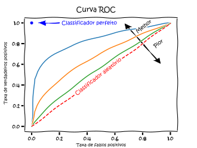

```{r setup, include=FALSE}
knitr::opts_chunk$set(echo = TRUE)

```


__TÍTULO:__ Fatores associados à evasão e conclusão de curso na UFRJ: análise de heterogeneidade

__PESQUISADOR:__ Melina Klitzke Martins

__ORIENTADOR:__ Rosana Heringer, Flávio Carvalhaes

__INSTITUIÇÃO:__ Universidade Federal do Rio de Janeiro

__FINALIDADE DO PROJETO:__ Doutorado

__PARTICIPANTES DA ENTREVISTA:__ 

- Melina Klitzke Martins
- Flávio Carvalhaes
- Monica Carneiro Sandoval 
- Denise Aparecida Botter
- Viviana Giampaoli
- Giovanna Vilar
- Mariana Almeida
- Renata Hirota

__DATA:__ 23/04/2020

__FINALIDADE DA CONSULTA:__ Consultoria sobre o modelo logístico multinível; 
auxílio na validação e interpretação do modelo

__RELATÓRIO ELABORADO POR:__ 
  
- Giovanna Vilar
- Mariana Almeida
- Renata Hirota  

\newpage

# 1 Introdução

A evasão dos alunos no ensino superior é uma situação recorrente e estudada por
diversos autores no campo da educação e das ciências sociais. Em suma, como as
variações  nos ambientes acadêmicos moldam as experiências e os resultados dos
alunos de diferentes  maneiras, as disparidades entre as distribuições dos
estudantes em todas as áreas de estudo, ainda  que pequenas, podem contribuir 
para entender as desigualdades de resultados quanto à evasão de curso.

A partir de um estudo observacional, a pesquisa busca analisar quais são os 
fatores associados à evasão de curso na UFRJ e como os efeitos desses fatores 
variam entre cursos. 

A metodologia utilizada pela pesquisadora é um modelo logístico multinível
(hierárquico), em que as variáveis de nível 1 são relacionadas às 
características dos estudantes e as variáveis de nível 2 são relacionadas aos
cursos. A pesquisadora busca com a entrevista uma consultoria sobre o modelo
logístico multinível e auxílio na validação e interpretação do modelo.


# 2 Descrição do estudo

Os dados foram analisados a partir de um modelo logístico multinível 
(hierárquico), em que as variáveis de nível 1 são relacionadas às 
características dos estudantes e as variáveis de nível 2 são relacionadas aos
cursos. 

As unidades amostrais da pesquisa são os ingressantes no primeiro semestre do 
ano de 2014, somando um total de 4.480 observações. Todos esses alunos foram
acompanhados até o primeiro semestre de 2019 (1 ano e meio após o perído de 
formação ideal). Apesar de serem dados longitudinais, como informado pela 
pesquisadora, tal característica não é considerada nesta etapa do estudo, 
uma vez que o estudo do tempo de evasão já foi realizado pela pesquisadora e 
não é objeto de pesquisa dessa análise.

A pesquisadora selecionou todos os cursos de modalidade presencial ofertados 
pela UFRJ e, a partir da volumetria, agrupou-os de acordo com o tipo de curso. 
Por exemplo, cursos como Letras-Espanhol, Letras-Inglês e Letras-Português foram
agrupados em um mesmo bloco. Ao fim desse agrupamento, foram obtidos 45 clusters
contendo, no mínimo, 30 observações. É importante ressaltar que o curso de 
Medicina foi excluído da análise por não ser possível observar a conclusão de
curso desses ingressantes, já que sua duração ideal ultrapassa o tempo de
acompanhamento. Além disso, outro argumento a favor da exclusão apontado pela
pesquisa é a baixa taxa de evasão observada no curso.


# 3 Descrição de um Modelo Multinível

Um modelo multinível com intercepto aleatório, sem variáveis de segundo nível, pode ser descrito da seguinte forma:

$$ logit (\pi_{ij}) = \beta_{0j} + \sum_{k}{ \beta_{k}*X_{kij}} + \epsilon_{ij} $$  
com $$ \beta_{0j} = \beta_{0} + u_{0j}  $$

para $j = 1,...,n$ clusters de cursos, $i = 1,..., n_{j}$ alunos no cluster $j$, e $k = 1,...,m$ variáveis independentes no modelo.
$u_{0j}$ é o efeito aleatório do j-ésimo cluster que compõe o intercepto, cuja 
distribuição segue uma N(0,$\sigma^{2}_{u_{0j}}$). Ressaltamos que $\beta_{0}$ é o efeito fixo do intercepto do modelo.

Os $X_{kij}$ são as variáveis independentes de primeiro nível utilizadas no modelo e os 
coeficientes $\beta_k$ são os coeficientes fixos do modelo. Os erros $\epsilon_{ij}$ têm
distribuição binomial com média zero e são independentes de $u_{0j}$
É importante destacar que componentes aleatórios podem ser acrescentados aos 
coeficientes das variáveis independentes. 
  
Caso exista uma variável de segundo nível o modelo pode ser definido da seguinte forma:

$$ logit (\pi_{ij}) = \beta_{0j}+\sum_{k}{ \beta_{kj}*X_{kij}} + \epsilon_{ij}   $$
com $$ \beta_{0j} = \beta_{00} + \beta_{02}*Z_j + u_{0j}$$  
 e   $$ \beta_{kj} = \beta_{k0} + \beta_{k2}*Z_j$$

para $j = 1,...,n$ clusters de cursos, $i = 1,..., n_{j}$ alunos no cluster $j$, e $k = 1,...,m$ variáveis independentes no modelo.
$u_{0j}$ é o efeito aleatório do j-ésimo cluster que compõe o intercepto, cuja 
distribuição segue uma N(0,$\sigma^{2}_{u_{0j}}$). Os erros $\epsilon_{ij}$ têm
distribuição binomial com média zero e são independentes de $u_{0j}$ 

Os $X_{kij}$ são as variáveis independentes de nível 1 utilizadas no modelo, os 
coeficientes $\beta_{kj}$ são os coeficientes fixos do modelo. Já $Z_j$ é uma variável no nível de cluster (nível 2).  
$\beta_{02}$ e $\beta_{k2}$ são os coeficientes de regressão associados à variável explicativa do nível 2 relativo à inclinação. É importante destacar que componentes aleatórios podem ser acrescentados aos coeficientes das variáveis independentes ($\beta_{kj}$).

Nos dois exemplos, nota-se que os interceptos variam de cluster para cluster (considera-se que possa existir diferenças entre os clusters), mas $\beta_{00}$ e os $\beta_{k0}$ são constantes para todos os clusters. Caso seja incluído outro efeito aleatório em alguma das variáveis, as inclinações relacionadas a essa variável também irão variar de cluster para cluster.


\newpage

# 4 Descrição das variáveis e processo de coleta de dados

## 4.1 Base de dados 

A base de dados utilizada foi construída a partir dos microdados da coorte
fornecidos pela Divisão de Registro de Estudante (DRE/Pr1) da UFRJ. A maioria 
das informações são coletadas através de questionário socioeconômico, produzido 
e aplicado pela instituição no ato da pré-matrícula do estudante. 
O alto índice de respostas deve-se, possivelmente, ao fato de que o estudante
precisa apresentar o comprovante da realização da pré-matrícula, exigido no ato 
de confirmação da matrícula presencial. 

O questionário é composto por questões que abordam, entre outras informações,
aspectos socioeconômicos, culturais, escolares, de composição familiar e de 
escolha e expectativas sobre o curso e sobre a instituição.

## 4.2 Variáveis

A variável dependente (resposta) utilizada nessa análise é a evasão do curso no
primeiro ano  (1° e 2° semestre), representada por 0 e 1 (0 = não evadiu; 1 =
evadiu). O conceito de evasão aqui utilizado é o de evasão do curso, que é 
aquela em que o aluno deixa o curso de origem por qualquer razão (LOBO, 2012). 
Essa variável leva em conta a situação de matrícula do aluno em cada semestre: 
ativa, trancada, cancelada ou cancelada por conclusão de curso. Apenas aqueles 
que tiveram suas matrículas no curso canceladas (exceto o cancelamento por 
conclusão de curso) foram considerados como alunos evadidos.

Em um estudo multinível as variáveis independentes são classificados em dois 
tipos: variáveis de nível 1 e variáveis de nível 2. Neste caso, as variáveis de
nível 1 são as relacionadas aos estudantes:  
  
- Cor/Raça (0 = brancos e 1 = pretos e pardos);
- Sexo (0 = feminino e 1 = masculino);
- Status socioeconômico da família (SES), mensurado pela maior escolaridade do
pai ou da mãe (0 = menos que o ensino superior e 1 = ensino superior);
- Nota do ENEM no ano de entrada;
- Variável que diz respeito à questão "se foi a primeira opção de curso" (0 = 
sim; 1 = não);
- Variável que diz respeito à questão "se a nota de corte influenciou na escolha
do curso" (0 = não; 1 = sim);
- Coeficiente de Rendimento acumulado por semestre (CRa), relacionado ao último
semestre acompanhado.
  
No nível 2 (relacionadas ao cluster), inicialmente a pesquisadora criou uma 
variável de seletividade de curso utilizando a nota mediana do curso no Enem com
a seguinte regra: se a nota mediana do curso no Enem era maior que a nota mediana
geral no Enem, ou seja, de toda UFRJ, o curso é mais seletivo. Caso contrário, o
curso é classificado como menos seletivo.
  
- Seletividade (0 = menos seletivo; 1 = mais seletivo)
  
Os dados originais estão armazenados em Excel e o modelo foi construído no 
software `Stata`

\newpage

# 5 Situação do Projeto 

O projeto encontra-se na fase de testes dos modelos multiníveis. Após a 
entrevista com a pesquisadora, foram feitas algumas sugestões à análise já 
realizada. 

Primeiramente, variáveis de nível 1 que podem ser estaticamente significantes 
foram excluídas do modelo testado. Anteriormente, um modelo de sobrevivência foi
construído e seus resultados foram utilizados para determinar as variáveis a 
serem incluídas nesta fase do estudo.

Salientamos que essa não é uma tomada de decisão correta pois variáveis que não 
se mostraram significantes na primeira etapa podem ser importantes na 
determinação do modelo multinível. São momentos e modelos diferentes, logo, 
todas as variáveis que a pesquisadora acredita afetar a evasão do curso devem 
ser testadas.

Além disso, as variáveis contínuas -- nota do ENEM e CRa -- possuem magnitudes 
muito distintas. O CRa é uma nota que varia de 0 a 10, enquanto que as notas do 
ENEM estão em uma escala de 0 a 1000. Essa diferença entre as escalas pode
desencadear erros de convergência durante os testes no software.

Outro problema relacionado à análise realizada é a forma como as saídas do Stata
estão sendo apresentadas e analisadas.

# 6 Conclusão e respostas às perguntas da pesquisadora

De forma geral, o projeto está em um estado bastante avançado, de forma que os
comentários a seguir se referem principalmente ao modelo escolhido pela 
pesquisadora e sugestões para melhorar a análise. Os comentários foram divididos
em seções tentando seguir uma ordem de precedência dos passos na análise 
estatística.

## 6.1 Sugestões sobre as variáveis

### 6.1.1 Inclusão de variáveis

A primeira sugestão oferecida é incluir no modelo todas as variáveis com bom
preenchimento (sem grande volumetria de dados faltantes) que a pesquisadora 
acredita ter algum efeito na evasão do curso. Durante os testes dos modelos, 
algumas podem se mostrar significantes e outras não, porém, é importante 
testá-las.

Além disso, também sugerimos o acréscimo de variáveis no 
nível 2. Por exemplo, o comportamento de evasão dos alunos parece ser diferente
entre as áreas do conhecimento (Humanas, Exatas e Biológicas), logo, seria
interessante construir essa variável categórica de curso.  

A seguir, incluímos uma lista de variáveis que podem ser incluídas no estudo:  
  
- Renda Familiar, _Nível 1_;
- Área do conhecimento do curso, _Nível 2_ (Humanas, Exatas e Biológicas); 
- Média da nota no ENEM do curso, _Nível 2_;
- Média do CRa do curso, _Nível 2_.

### 6.1.2 Uniformização na escala das variáveis

Destacamos a importância de uniformizar as variáveis contínuas referentes à nota 
do ENEM, pois, como explicado anteriormente, as magnitudes distintas entre os 
valores da variável CRa e os valores da variável nota do ENEM podem interferir 
na convergência matemática. 

Sugerimos que os valores da variável de nota sejam transformados em números na
escala de 0 a 10, a mesma utilizada no coeficiente de rendimento acumulado por
semestre.

Pontuamos também que não há um consenso na literatura quando se fala de 
padronizar variáveis em modelos multiníveis, e portanto a necessidade de 
padronizar está  relacionada com a interpretação da variável em todos os seus 
níveis (como há interesse em analisar os resultados com as variáveis CRa e nota 
do ENEM no nível zero, não há necessidade de padroziná-las, uma vez que a 
interpretação será outra).

### 6.1.3 Interação entre variáveis

Por fim, sugerimos testar interações entre as variáveis de nível 1, como por 
exemplo $x_1$: Cor/Raça e $x_2$: Status socioeconômico da família (SES). Se a
interação está presente e é significativa, o efeito de $x_1$ na resposta média
depende do nível de $x_2$ e, analogamente, o efeito de $x_2$ na resposta média
depende do nível de $x_1$.
Salientamos que sejam testadas apenas interações de interesse de análise da 
pesquisadora, para que não haja uma complicação além do necessário na 
interpretação do modelo. Além disso, essas interações devem ser acrescentadas no modelo após os primeiros testes citados na seção 6.2. 

## 6.2 Construção do modelo e Medidas de desempenho

Quando construímos um modelo é sempre necessário checar a eficácia do mesmo. 
Além disso, precisa-se utilizar uma métrica para comparar diferentes modelos e
encontrar qual o melhor para o conjunto de dados. Assim, esse tópico foca em
apresentar medidas de desempenho para o ajuste da regressão logística 
multinível. Destacamos que, de acordo com a literatura, o nível de significância estátistica selecionado para testar as variáveis será de: p-valor < 0.05  
A seguir, montamos um roteiro para essa etapa.

__Passo 1__: Ajuste do modelo sem variáveis independentes (modelo nulo) para
calcular o coeficiente de correlação intraclasse e testar se as variâncias em
diferentes clusters são homogêneas;
  
__Passo 2__: Incluir as variáveis independentes, separadamente, e observar a significância da variável incluída. Após essa etapa, testar modelos com mais de uma variável que apresentou significância e avaliar se o ajuste do modelo melhora com a
introdução das variáveis explicativas. Essa avaliação pode ser feita através de uma medida de critério de informação com penalização da complexidade do modelo, como o BIC, AIC, ou através da estatística _deviance_. Sugerimos que, primeiramente, sejam testadas as variáveis do nível mais baixo, ou seja, as relacionadas com os alunos, porque existe um maior número de observações disponíveis neste nível.  
O modelo escolhido nesse primeiro passo será o modelo com variáveis que sejam significativas e que tenha o menor BIC,AIC ou _deviance_, definidos como:


$$AIC = -2ln(likelihood) + 2k$$
$$BIC = -2ln(likelihood) + ln(N) k$$
Sendo $k$ o número de parâmetros estimados e $N$ o número de observações.  
  
Por meio da _deviance_ também é possível medir o grau de desajuste do modelo. A 
_deviance_ é definida por:

$$
Deviance = -2 ln(likelihood_0) - [-2ln(likelihood_1)]
$$

em que $likelihood_0$ é a verossimilhança do modelo nulo, ou seja, sem a presença de
covariáveis, e $likelihood_1$ é a verossimilhança do modelo completo.

Assim, tem-se que o modelo que apresentar a menor deviance é aquele que melhor 
se ajusta ao conjunto de dados.

O software `Stata` apresenta na parte superior da saída (log likelihood) o log da
verossimilhança do modelo testado ($ln (likelihood_{*})$).  
  
Salientamos que nesse primeiro passo é importante testar modelos com vários conjuntos diferentes de variáveis, entendendo quais fazem sentido para o estudo. Uma variável pode ser não significativa quando testada sozinha no modelo, porém, pode apresentar significância quando avaliada conjuntamente com outra variável. Além disso, as medidas AIC, BIC e _deviance_ são usadas para sugerir alguns modelos “melhores”, mas o pesquisador é responsável por selecionar aquele que considera mais alinhado com a teoria e literatura da área.

__Passo 3__: Analisa-se o modelo incluindo, separadamente, cada uma das
variáveis explicativas fixas no nível do cluster. Realizar as análises da forma citada no passo anterior;  
  
__Passo 4__: Acrescentar novas variáveis até que nenhuma outra seja 
significativa, chegando a um ou vários candidatos a modelo final;
  
__Passo 5__: Fazer o diagnóstico dos candidatos a modelo final, verificando os
pressupostos e a qualidade do ajuste.

A curva ROC pode auxiliar a visualizar quão bem o modelo classifica as 
observações pois é uma representação gráfica que ilustra o desempenho de um modelo de  classificação binária. 
  
Se o resultado previsto pelo modelo é 1 e o valor real também é 1, então o resultado é chamado de verdadeiro positivo; no entanto, se o valor real é 0 e o valor previsto foi 1 então dizemos que o resultado é um falso positivo. Por outro lado, um verdadeiro negativo  ocorre quando o resultado da previsão é 0 e o valor real também é 0, e um falso negativo é quando o resultado da previsão é 0 enquanto o valor real é 1.
  
Geralmente, observamos no eixo x a taxa de falsos positivos, ou seja, valores que o modelo classificou erroneamente como positivos, e no eixo y a taxa de verdadeiros positivos, ou seja, valores que o modelo classificou corretamente como positivos.
  
Logo, quanto mais próxima do canto superior esquerdo está a curva, melhor a 
classificação do modelo pois menor a taxa de falsos positivos e maior a taxa de
verdadeiros positivos. O melhor método de previsão possível (teórico) produziria um ponto no canto superior esquerdo do plano descrito pelo espaço, isto é, o ponto com coordenadas (0,1). Nesse ponto temos 100% de sensibilidade (isto é, não temos falsos negativos) e 100% de especificidade (isto é, não temos falsos positivos). O ponto (0,1) também é denominado "classificação perfeita".

A seguir, uma ilustração com exemplos de como avaliar o gráfico da curva ROC.

```{r echo=FALSE}

```
[site da imagem](https://pt.wikipedia.org/wiki/Caracter%C3%ADstica_de_Opera%C3%A7%C3%A3o_do_Receptor).  

\newpage
  
Há diversas formas de calcular os valores para a curva ROC no `Stata`, segundo
descrito no 
[site do software](https://www.stata.com/features/overview/receiver-operating-characteristic/).

Por fim, podemos avaliar o ajuste do modelo realizando uma análise residual através
de um gráfico dos resíduos estimados (as estimativas do $u_{0j}$ na definição do modelo anterior) e os quantis da distribuição teórica normal. Idealmente, os resíduos coincidem com os quantis, formando uma linha reta diagonal pois eles seguem a distribuição determinada.
Em outras palavras, para verificar o pressuposto de normalidade do efeito aleatório do cluster, pode-se verificar se os resíduos desses clusters são aproximadamente normais. O gráfico deverá apresentar no eixo x os quantis teóricos da distribuição normal, em relação aos resíduos no eixo y.
Salientamos que, caso exista mais de um efeito aleatório no modelo, todos devem ser analisados para entender se eles respeitam o pressuposto de distribuição normal.

\newpage

## 6.3 Interpretação do modelo

Na regressão logística de efeitos mistos, os coeficientes fixos têm uma
interpretação condicional aos efeitos aleatórios. No caso do estudo analisado, 
as interpretações estão condicionadas aos cursos. O exemplo a seguir, extraído
do manual do `Stata`, ilustra como o modelo pode ser interpretado a partir da 
saída do software.

__Exemplo (1)__:  

Ng et al. (2006) analisam uma subamostra de dados da pesquisa de fertilidade de
Bangladesh de 1989 (Huq e Cleland 1990), que entrevistou 1.934 mulheres de
Bangladesh sobre o uso de anticoncepcionais. As mulheres na amostra pertenciam a
60 distritos, identificadas pela variável `district`. Cada distrito continha 
áreas urbanas ou rurais (variável urban) ou ambas. A variável `c_use` é a 
resposta binária, com um valor de 1 indicando o uso de anticoncepcionais. Outras 
covariáveis incluem idade centrada na média e uma variável categorizada para o 
número de filhos. A idade foi centralizada por escolha dos pesquisadores do artigo, uma vez que a variável Idade igual a zero não traz informação relevante (mulheres
com 0 anos não tomam anticoncepcionais, nem participaram da pesquisa, logo o intercepto dessa variável não seria interpretável).

```{r echo=FALSE}
df <- data.frame('Variável' = c('c_use','district','urban','age','children 1','children 2','children 3'),
             'Label' = c('1 = Usa Contraceptivo','Distrito','Urbano ou Rural','Idade Centralizada','1 filho = 1','2 filhos = 1','3 filhos = 1')) 
knitr::kable(df)
```

Considere um modelo de regressão logística hierárquico:
  
$$ log (\frac{\pi_{ij}}{1-\pi_{ij}}) = (\beta_0 +u_{0j})+ \beta_1*1.urban_{ij} + \beta_2*age_{ij} + \beta_3*1.children_{ij} + \beta_4*2.children_{ij} + \beta_5*3.children_{ij} $$ 
  
para $j = 1,...,60$ distritos, com $i = 1,..., n_{j}$ mulheres no distrito $j$  
$u_{0j}$ é o efeito aleatório do intercepto cuja distribuição segue uma distribuição N(0,$\sigma^2_{u_{0j}}$)  
Já os coeficientes $\beta_0$,$\beta_1$,$\beta_2$,$\beta_3$,$\beta_4$ e $\beta_5$ são os efeitos fixos do modelo enquanto $\pi_{ij}$ é a probabilidade do indíviduo $i$ no cluster $j$ apresentar resposta positiva (=1)

Nota-se que os interceptos variam de distrito para distrito (considera-se que possa existir diferenças entre eles), mas $\beta_0$,$\beta_1$,$\beta_2$,$\beta_3$,$\beta_4$ e $\beta_5$ são constantes para todos os clusters. Caso seja incluído outro efeito aleatório em alguma das variáveis, as inclinações relacionadas a essa variável também irão variar de distrito para distrito.

No software `Stata` a equação é dada por:  

__`melogit c_use i.urban age i.children || district:`__

Abaixo incluímos uma tabela das estimativas de efeitos fixos. As estimativas
representam os coeficientes de regressão, estes não são padronizados e estão na
escala logit. As estimativas são seguidas por seus erros padrão (SEs), p-valor e
intervalos de confiança.

O teste de razão de verossimilhança (LR) testa a hipótese nula de que os dois
modelos, efeitos mistos e regressão logística fixa fornecem a mesma qualidade de
ajuste. Como p-valor < 0.001, há indícios para rejeitar a hipótese nula e utilizar,
assim, o modelo misto.

```{r echo=FALSE}
knitr::include_graphics("modelo_aleatorio_v2.png")
```
  
A segunda seção nos dá a estimativa da variância do componente aleatório do
intercepto na escala logit ($\hat\sigma^2_{u_{0j}}$). 

Como queremos a razão de chances em vez dos coeficientes na escala logit, 
podemos exponenciar as estimativas e os intervalos de confiança. Podemos fazer 
isso no `Stata` usando a opção __OR__. A tabela de estimativa relata os efeitos fixos
e os componentes de variância estimados. Os efeitos fixos podem ser 
interpretados da mesma forma que a saída do logit tradicional. Transformando em
razão de chances, descobre-se que a chance das mulheres em zona urbana usarem
anticoncepcionais é o dobro das mulheres em zona rural. Além disso, ter qualquer
número de filhos aumentará as chances de três a quatro vezes em comparação com a
categoria base de não ter filhos. O uso de anticoncepcionais também diminui 
com a idade. 

__Exemplo (2)__  

Caso seja do interesse da pesquisadora introduzir um coeficiente aleatório em 
alguma variável independente, pode-se reescrever o modelo com _random slopes_, ou
seja, os coeficientes da variável escolhida vão variar entre clusters.

Vamos aplicar essa ideia na variável binária urbana do exemplo anterior.
A expressão desse modelo pode ser descrita da seguinte forma:  

$$ 
log(\frac{\pi_{ij}}{1-\pi_{ij}}) = (\beta_0 +u_{0j}) + (\beta_1 + u_{1j})*1.urban_{ij} +
\beta_2*age_{ij} + \beta_3*1.children_{ij} + \beta_4*2.children_{ij} + 
\beta_5*3.children_{ij}
$$ 

para $j = 1,...,60$ distritos, com $i = 1,..., n_{j}$ mulheres no distrito $j$  

$u_{0j}$ é o efeito aleatório do intercepto cuja distribuição segue uma N(0,$\sigma^2_{u_{0j}}$) e $u_{1j}$ é o efeito aleatório da variável urban cuja distribuição segue uma N(0,$\sigma^2_{u_{1j}}$)   

Já os coeficientes $\beta_0$,$\beta_1$,$\beta_2$,$\beta_3$,$\beta_4$ e $\beta_5$ 
são os efeitos fixos do modelo
$\pi_{ij}$ é a probabilidade do indíviduo $i$ no cluster $j$ apresentar resposta
positiva (=1).

Nota-se que os interceptos variam de distrito para distriro (considera-se que possa existir diferenças entre eles), e que agora a inclinação referente a variável 
_urban_ também varia de distrito para distrito, pois foi incluído um efeito aleatório  nessa variável.  

Agora, percebe-se que na estrutura de variância do modelo existe uma covariância entre os dois efeitos aleatórios, ou seja, $\sigma(u_{0j},u_{1j})$. Nesse caso, temos duas opções de estrutura:
  
1) Uma estrutura de covariância que permite variâncias distinta para cada
efeito dentro de uma equação de efeitos aleatórios ($\sigma^2_{0j}$ $\neq$ $\sigma^2_{1j}$)) e assume que todas as covariâncias ( $\sigma(u_{0j},u_{1j})$) são 0.

$$ \sum = Var\left(\begin{array}{cc} 
u_{0j}\\
u_{1j}
\end{array}\right)  = \left(\begin{array}{cc} 
\sigma^2_{0j} & 0\\
0 & \sigma^2_{1j}
\end{array}\right)$$

No software `Stata` o parâmetro __covariance(independent)__ define essa estrutura.Esse é o parâmetro _default_ do melogit

2) Uma estrutura de covariância que permite que todas as variâncias e covariâncias sejam distintas 

$$ \sum = Var\left(\begin{array}{cc} 
u_{0j}\\
u_{1j}
\end{array}\right)  = \left(\begin{array}{cc} 
\sigma^2_{0j} &  \sigma(u_{0j},u_{1j}))\\
 \sigma(u_{0j},u_{1j}) & \sigma^2_{1j}
\end{array}\right)$$

No software `Stata` o parâmetro __covariance(unstructured)__ define essa estrutura. 

Para escolhar qual dos dois modelos deve ser usado é necessário realizar um teste no qual a hipótese nula seja:
  
$H_0$:  $\sigma(u_{0j},u_{1j}) = 0$

Vamos rodar e salvar os dois tipos de modelo para realizar um teste de verossimilhança através do função __lrtest__

__melogit c_use i.urban age i.children || district: i.urban__ (*)

__estimates store r_urban__

__`melogit c_use i.urban age i.children || district: i.urban, covariance(unstructured)`__

__estimates store r_urban_corr__

__lrtest r_urban r_urban_corr__

Vemos abaixo que há indicíos para rejeitarmos o modelo (*) em favor de um que permite a correlação entre $u_{0j}$ e $u_{ij}$ (p-valor < 0.05)

```{r echo=FALSE}
knitr::include_graphics("teste_var.png")
```


Logo, no software `Stata`, a equação escolhida é dada por:  

__`melogit c_use i.urban age i.children || district: i.urban, covariance(unstructured)`__

\newpage

O modelo agora inclui um coeficiente aleatórioem `1.urban` pois acredita-se que
o impacto dessa variável difere de distrito para distrito. Além disso, ao 
especificar a covariância (não estruturada) acima, permitimos a correlação entre
efeitos aleatórios a nível distrital, ou seja, a correlação entre $u_{0j}$ e $u_{1j}$
é diferente de zero ($\sigma_{u_{0j},u_{1j}}$).
  
```{r echo=FALSE}
knitr::include_graphics("modelo_slope_aleatorio_v1.png")
```


## 6.4 Correlação Interclasse

Após o ajuste de um modelo logístico multinível com __melogit__, pode-se 
encontrar diversas outras medidas e estatísticas. O índice de correlação
intraclasse __(ICC)__ varia de 0 a 1 e indica o quanto da variação é explicada 
pela diferença entre cursos.

- Um ICC = 0 indica que os cursos são homogêneos entre si, ou seja, a evasão 
independe do curso;  
- Um ICC = 1 indica que toda a variação pode ser explicada pela diferença entre 
os cursos. A seguir, apresentamos a fórmula matemática da métrica para o exemplo (1)

$$ ICC = \frac{\hat\sigma_{u^2_{0j}}}{\hat\sigma^2_{u_{0j}} + (\pi^2/3)} $$
sendo $\hat\sigma^2_{u_{0j}}$ a estimativa da variância do efeito aleatório do intercepto.

Ou seja, um ICC = 0.12 indicaria que 12% da chance de evasão na UFRJ é explicada
pela diferença entre os cursos e 88% da chance de evasão é explicada pelas
diferenças dentro dos cursos. É importante destacar que o ICC é encontrado 
quando rodamos um modelo "vazio", ou seja, apenas com o intercepto.

No software `Stata`, esse índice é encontrado através do código __`estat icc`__.  
A seguir, definimos um passo a passo para obter a probabilidade marginal média.

Salientamos que a correlação interclasse não se altera quando existem variáveis no nivel 2, pois ela é estimada por meio do modelo nulo, ou seja, por um modelo que não inclui variáveis explicativas.

## 6.6 Estimação das probabilidades

Encontrar as probabilidades de resposta positiva (=1) em cada cluster pode ser do interesse da pesquisadora. Assim, definimos um passo a passo de como obter esses valores, utilizando como referência o exemplo (1) presente nesse relatório (modelo sem efeito aleatório nas variáveis independentes). Essa passagem pode ser expandida a fim de encontrar as probabilidades  estimadas, por cluster, de acordo com as categorias de uma variável independentes específica


1. Estimar os efeitos aleatórios

Os efeitos aleatórios não são fornecidos como estimativas quando o modelo é ajustado, logo, eles precisam ser calculados.
No `Stata`, a função __`predict`__ cria uma nova variável contendo predições, como respostas médias, previsões lineares, densidade e funções de distribuição, erros padrão, desvio e
resíduos de Anscombe. Após rodar o modelo, pode-se usar essa função para estimar os parâmetros aleatórios

Ex: __`predict nome, reffects`__
  
2. Calcular o valor da expressão logistica substituindo os termos pelas 
estimativas dos efeitos fixos e estimativas dos efeitos aleatórios (valores
encontrados em __1__). Chamamos esse valor de $x$

Ex: 
  
$$x = log(\frac{\pi_{j}}{1-\pi_{j}}) = (\hat\beta_0 +\hat{u_{0j}})$$
 $\hat\beta_0$ sendo a estimativa do parâmetro fixo e $\hat{u_{0j}}$ as estimativas dos parâmetros aleatórios, com $j$ =1,...60
  

3. Como o valor encontrado está na forma de logaritmo da chance, precisamos
exponenciá-lo para obter as probabilidades previstas.

$$ \hat\pi_{j}= \frac{exp(x)}{1+exp(x)} $$
Logo, $\hat\pi_{j}$ é a probabilidade média, por distrito, das mulheres usarem anticoncepcional


Aplicação das etapas no `Stata`:
  

1. __`predict pred_efeitos_aleat_re, reffects`__
  
`pred_efeitos_aleat_re1`: estimação da parte aleatória do intercepto

2. __`generate rxb = _b[_cons] + pred_efeitos_aleat_re1`__

`rxb`: estimação da parte constante do intercepto + parte aleatória do 
intercepto  

$$rxb = log(\frac{\pi_{j}}{1-\pi_{j}}) = (\hat\beta_0 +\hat{u_{0j}})$$

3. __`generate prob_anti = exp(rxb)/(1 + exp(rxb))`__

`prob_anti`: a probabilidade média de uma mulher usar anticoncepcional em cada 
distrito 


Se o interesse for encontrar as probabilidades estimadas, por distrito, de acordo 
com as categorias de uma variável independentes específica, os passos são os mesmos. Porém, devemos acrescentar o valor dessa variável multiplicado pela estimativa de seu parâmetro.
Vamos substituir a fórmula do modelo pelos valores encontrados para entender o
comportamento da variável urban na resposta.

1. __`predict pred_efeitos_aleat_re*, reffects`__

`pred_efeitos_aleat_re1`: estimação da parte aleatória do intercepto e do coeficiente da variável

2. __`generate rxb_urban  = (_b[_cons] + pred_efeitos_aleat_re1) + _b[i.urban]*1`__
   

   __`generate rxb_fem = (_b[_cons] + pred_efeitos_aleat_re1) + _b[i.urban]*0`__

Logo,

$$ rxb_{urban} = log(\frac{\pi_{j}}{1-\pi_{j}}) = (\hat\beta_0 +\hat{u_{0j}})+ \hat\beta_1*1$$
$$rxb_{rural} = log(\frac{\pi_{j}}{1-\pi_{j}}) = (\hat\beta_0 +\hat{u_{0j}})+ \hat\beta_1*0$$

`rxb_urban` e `rxb_rural` são as predições marginais do logaritimo da chance para
mulheres que vivem no ambiente urbano e mulheres que vivem no ambiente rural, respectivamente

`rxb*` = estimação da parte constante do intercepto + parte aleatória do 
intercepto + parte fixa da variável urban 

3. __`generate prob_curso_urban = exp(rxb_urban)/(1 + exp(rxb_urban))`__

   __`generate prob_curso_rural = exp(rxb_rural)/(1 + exp(rxb_rural))`__

`prob_curso_urban` é a probabilidade média das mulheres que vivem na zona urbana usarem anticoncepcional em cada distrito  
  
`prob_curso_rural` é a probabilidade média das mulheres que vivem na zona rural usarem anticoncepcional em cada distrito

A discrepância entre as probabilidades de usar anticoncepcional por zona (rural ou urbano), em cada distrito, se dá por conta do efeito fixo da zona, ou seja, quando a variável urbana muda (0 = rural, 1 = urbana) o coeficiente referente a essa variável é acrescentado 
na equação do modelo e, consequentemente, afeta os valores finais das
probabilidades. 

Lembrando que o efeito é fixo, logo, ele não varia por distrito. Se há interesse na
variação dessa influência por distrito, é necessário considerar a variável como um 
fator aleatório. 


## 6.7 Bibliografia

FERRAZ, A.P. (2013). Avaliação do rendimento dos alunos em disciplinas ofertadas
pelo departamento de estatística para outros cursos da universidade de Brasília:
uma aplicação de regressão logística multinível. Brasília. 86p. Dissertação
(Trabalho de conclusão de curso). Instituto de Ciências Exatas - UNB.

HUQ, N.M., CLELAND, J. (1990). Bangladesh Fertility Survey 1989 (Main Report). 
National Institute of Population Research and Training.

NG, E.S.W., CARPENTER, J.R., GOLDSTEIN, H., RASBASH, J. (2006). Estimation in
generalised linearmixed models with binary outcomes by simulated maximum 
likelihood. Statistical  Modelling. 6:23–42. <[https://doi.org/10.1191/1471082X06st106oa](https://doi.org/10.1191/1471082X06st106oa)>

ROCHA, A.L.M.M. (2014). Regressão logística multinível: uma aplicação de modelos 
lineares generalizados mistos. Brasília. 87p. Dissertação (Trabalho de conclusão
de curso). Instituto de Ciências Exatas - UNB.

TAMURA, K.A (2014). Modelo logístico multinivel: um enfoque em métodos de estimação e predição. São Paulo. Dissertação de Mestrado. Instituto de Matemática e Estatística - IME.

STATACORP (2013). Stata multilevel mixed-effects reference manual. Release 13.
College  Station,  TX:  StataCorp  LP. Disponível em  
<[https://www.stata.com/manuals/memelogit.pdf](https://www.stata.com/manuals/memelogit.pdf)> Acesso em: 27 de abril de 2021.

MANUAL STATA. BIC note — Calculating and interpreting BIC em: <[https://www.stata.com/manuals/rbicnote.pdf](https://www.stata.com/manuals/rbicnote.pdf)> Acesso em: 27 de abril de 2021

MANUAL STATA. lrtest — Likelihood-ratio test after estimation em: <[https://www.stata.com/manuals/rlrtest.pdf](https://www.stata.com/manuals/rlrtest.pdf)> Acesso em: 08 de maio de 2021


