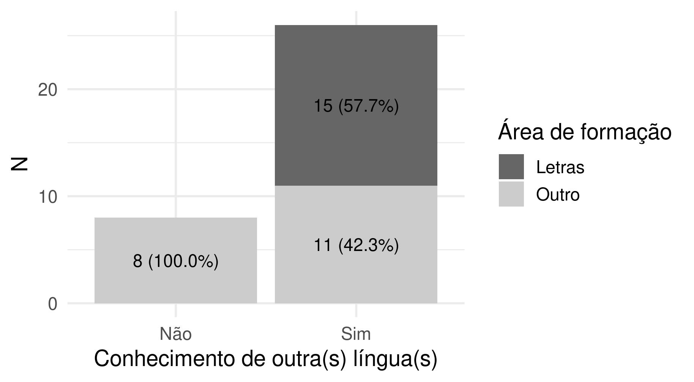
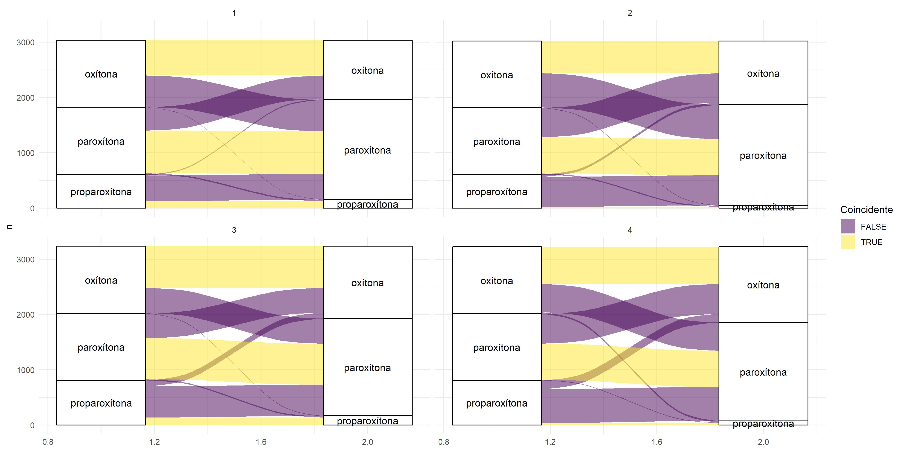
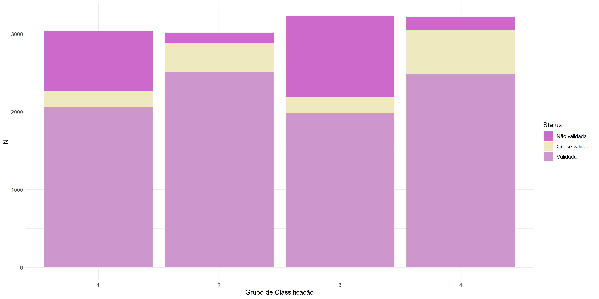

#    Gráficos {#graficos}

```{r area_linguas}

```
<br>

```{r tonicidade-fluxo, echo=FALSE, message=FALSE, warning=FALSE}


```


```{r}
pseudopalavras::dados %>% 
  dplyr::count(grupo, tonicidade_producao, tonicidade_alvo) %>% 
  # dplyr::filter(grupo == 1) %>% 
  ggplot2::ggplot(ggplot2::aes(
    x = tonicidade_alvo, y = n, fill = tonicidade_producao
  )) +
  ggplot2::geom_col() +
  scale_fill_viridis_d()+
  ggplot2::facet_wrap(~grupo)
  


```


```{r}
pseudopalavras::dados %>% 
  dplyr::count(grupo, tonicidade_producao, tonicidade_alvo) %>% 
  tidyr::pivot_wider(names_from = tonicidade_alvo, values_from = n) %>% 
  dplyr::mutate(grupo = dplyr::case_when(
    grupo == 1 ~ "1 (Similar de alta freq.)",
    grupo == 2 ~ "2 (Dissimilar de alta freq.)",
    grupo == 3 ~ "3 (Similar de baixa freq.)",
    grupo == 4 ~ "4 (Dissimilar de baixa freq.)"
  )) %>% 
  knitr::kable(col.names = c(
    "Grupo", "Tonicidade de produção", "Oxítona", "Paroxítona",
    "Proparoxítona"
  ),
    caption = "Distribuição das respostas nos níveis da variável Tonicidade de produção.",
    booktabs = TRUE,
    table.attr = "style='width:100%;'"
  ) %>% 
  kableExtra::kable_styling(full_width = TRUE)
```
```{r validacao_grupo}

```


