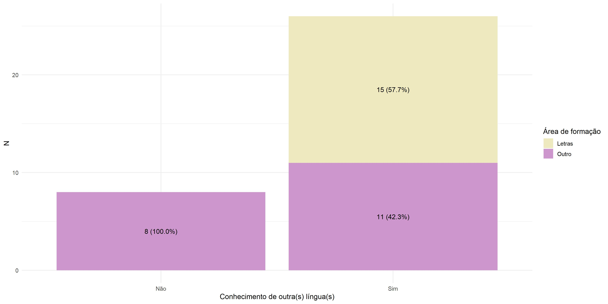

```{r setup, include = FALSE}
knitr::opts_chunk$set(echo = FALSE, 
                      message = FALSE, 
                      comment = FALSE, 
                      warning = FALSE, 
                      fig.height = 6, 
                      fig.width = 9)
library(patchwork)
library(magrittr)
participantes <- pseudopalavras::dados %>% 
  dplyr::distinct(informante, .keep_all = TRUE) 
```

<!-- # Sobre este documento {-} -->

<!-- Este relatório foi produzido em *RMarkdown*, utilizando o software estatístico R na versão `r paste(version$major, version$minor, sep = ".")`. -->

<!--chapter:end:index.Rmd-->

# Introdução {#introducao}


De acordo com @petter2007, o interesse pela linguagem é antigo e vem sendo expresso 
por meio de mitos, lendas, cantos, rituais e trabalhos eruditos que buscam conhecer
essa capacidade humana como sistema de comunicação. A autora aponta que, a partir do
século XX, os estudos linguistícos passaram a ter um caráter científico, ou seja, 
centrados na observação dos fatos a partir de pressupostos teóricos da linguagem, no
estabelecimento de hipóteses e na examinação mediante experimentos.

Conforme descrito por @fiorin2019, a linguística é uma ciência da linguagem porque,
ao contrário da gramática, ela tem como objetivo estabelecer o que uma língua é 
e por que é de uma determinada maneira. Logo, a área estuda os aspectos fonéticos,
morfológicos, sintáticos, semânticos, sociais e psicológicos de uma língua, e neste
caso, o português brasileiro. Dentro deste contexto, existe o conceito de _pseudopalavra_,
que, de acordo com o dicionário @priberan, é uma 

> Sequência regular e pronunciável de  caracteres que não tem um significado numa língua, apesar de obedecer às regras ortográficas, morfológicas ou de pronúncia

No português brasileiro existem três classes de palavras segundo sua tonicidade: 
oxítona, paroxítona e proparoxítona. Essas denominações estão relacionadas à
intensidade dada a determinadas sílabas na pronúncia das palavras. Aquela que é
pronunciada de forma mais acentuada é a sílaba tônica. Assim, oxítonas são as palavras
cuja sílaba tônica é a última; paroxítonas são as palavras cuja sílaba tônica é 
a penúltima; e proparoxítonas são as palavras cuja sílaba tônica é a 
antepenúltima.

O intuito do trabalho é investigar a maneira como os falantes nativos do 
português atribuem a tonicidade em pseudopalavras parcialmente relacionadas a vocábulos
existentes no idioma. Em outras palavras, busca-se compreender como o indivíduo,
ao se deparar com uma palavra nova, nesse caso, uma pseudopalavra, define a sílaba 
tônica. Além disso, busca-se entender quais são os outros fatores, tais como os
conhecimentos linguísticos do falante e as estruturas linguísticas das palavras que
podem influenciar nesse processo de classificação e portanto da determinação da entonação.


<!-- ## Organização do trabalho -->

<!-- O relatório foi organizado em XX capítulos, além desta introdução. No Capítulo \@ref(inferencia), apresentamos o modelo proposto, procedimento de análise e organização dos dados. No Capítulo \@ref(conclusoes), apresentamos os principais resultados da análise, organizados de acordo com as questões levantadas pela pesquisa. -->


<!--chapter:end:01-introducao.Rmd-->

# Objetivo(s)

O objetivo principal do trabalho é verificar se pseudopalavras criadas a partir de
palavras reais, aqui denominadas palavra-alvo, podem sofrer um processo análogo e ter
o mesmo padrão acentual da referência real. Além disso, buscamos entender quais são os
conhecimentos linguísticos do falante utilizados nesse processo de acentuação tônica das
pseudopalavras e determinar um modelo que explique a classificação das pseudopalavras.

Algumas perguntas a serem respondidas pela análise estatística são: 

1. A classificação tônica das pseudopalavras pode recuperar o acento das palavras-alvo
semelhantes a elas? Em outras palavras, entender se a tonicidade da palavra-alvo 
tem papel na predição do acento da pseudopalavra.
 
2. As características fonológicas e estruturais das palavras-alvo têm influência 
na acentuação tônica das pseudopalavras? 

3. A taxa de similaridade influencia na associação acentual?
Entender se quanto mais similar a pseudopalavra for da palavra-alvo, maiores são as 
chances de atribuição do mesmo padrão acentual da palavra-alvo

4. As variáveis selecionadas pelo modelo estão em concordância com a literatura 
da área?  Existem variáveis linguísticas, extralinguísticas -relacionadas aos participantes- 
e experimentais -relacionadas ao estudo-, que podem, segundo a literatura da área, 
influenciar o comportamento acentual no português. 

5. Há associação entre graduação em letras e a classificação tônica da pseudopalvra?
Há associação entre conhecimento em música e a classificação tônica da pseudopalvra? 
Espera-se que indivíduos com conhecimento em música ou que entraram recentemente em letras
tenham um comportamento de classificação das pseudopalavras distinto dos demais.


<!--chapter:end:02-objetivo.Rmd-->

# Descrição do estudo {#descricao-estudo}

O estudo foi realizado de maneira remota com reuniões individuais entre a pesquisadora 
e cada um dos participantes via Google Meet. Consistiu em apresentar aos 
participantes, através do software Psychopy, 372 pseudopalavras agrupadas nos
denominados grupos de estímulos e registrar a forma como eles reproduziam verbalmente
tais palavras criadas. A seguir, as respostas dos participantes foram classificadas
de acordo com as três classes de acentuação tônica: oxítona, paroxítona e proparoxítona.

A coleta dos dados foi realizada no início do primeiro semestre de 2020 com 34
indivíduos que, por meio de divulgações em redes sociais e de colegas, se
voluntariaram a participar do experimento. Os voluntários tiveram como pré-requisitos,
ser maior de 18 anos, ser falante nativo do português brasileiro e não ter estudado
linguística. 

Entre os participantes da pesquisa encontram-se estudantes do primeiro semestre da
faculdade de Letras da Universidade de São Paulo, músicos, alguns residentes de fora 
do estado de São Paulo, entre outros. Supõe-se que os alunos do primeiro semestre 
do curso de Letras ainda não têm conhecimento na área. 

## Limitações do estudo

Identificamos dois eventuais problemas -um de caráter técnico e outro de aleatorização-
na coleta de dados que tentaremos contornar nas análises. O primeiro é descrito a
seguir, enquanto o outro será mencionado na seção \@ref(var-experimentais). 

__Problemas técnicos e interferência externa__

Destaca-se a perda de algumas respostas durante o processo de coleta de dados,
visto que ruídos externos impediram que algumas entonações fossem captadas e 
registradas na gravação. Logo, na base de dados não temos 372 registros de 
pseudopalavras para todos os participantes. Portanto, um total de 12.511 dados serão
utilizados na análise, em vez dos 12.648 esperados, o qual não representa uma perda 
substancial. 


## Conceitos de Similaridade e Validação

O conceito de similaridade entre palavra-alvo e pseudopalavra foi construído com base
nas mudanças feitas na palavra-alvo até a obtenção da pseudopalavra. Essas alterações
estão relacionadas à mudanças de ponto, modo e/ou vozeamento.

De acordo com o tipo e a quantidade de alterações, foi estabelecido um valor de 1 a 10 
-chamado de taxa de similaridade-, onde valores menores de 4 determinam palavras similares
e valores maiores ou iguais a 5 determinam palavras dissimilares. Diante disso, foi 
necessário definir um modo de validar essa classificação em similar e dissimilar. 

Esse ponto está relacionado aos testes para validar se a pseudopalavra é similar 
à palavra a partir da qual ela foi criada (palavra-alvo). Nessa etapa -chamada de 
validação- pediu-se para 10 falantes do português, que não fazem parte do estudo final,
listarem a palavra real a qual eles associavam a palavra criada. Considerou-se 
validadas como "similar à palavra-alvo" as pseudopalavras cuja associação foi a 
palavra-alvo na resposta de, no mínimo, oito indivíduos.Porém, pseudopalavras nas 
quais sete falantes apresentaram a associação correta foram classificadas como quase 
validadas.  
  
Da mesma forma, foram consideradas validadas como "dissimilar à palavra-alvo" pseudopalavras
não associadas a uma mesma resposta por mais de dois indivíduos. Em outras palavras, se até 
dois falantes associaram uma mesma palavra à pseudopalavra, ela foi considerada
dissimilar à sua palavra-alvo. Pseudopalavras nas quais três falantes apresentaram a 
mesma associação foram classificadas como quase validadas. Ressalta-se que, nesse caso,
a associação não precisava ser exclusivamente com a palavra-alvo.


<!--chapter:end:03-descricao.Rmd-->

# Descrição das variáveis {#descricao-variaveis}

Foram coletadas variáveis linguísticas -relacionadas às pseudopalavras-, 
extralinguísticas -relacionadas aos participantes- e experimentais -relacionadas 
ao estudo-, que podem, segundo a literatura da área, influenciar o comportamento
acentual no português. A seguir, listamos as variáveis pré-selecionadas para o estudo. 
  
  
## Variável Dependente

A variável resposta de interesse é __Tonicidade da pseudopalavra__, ou seja, a
classificação acentual tônica da pseudopalavra (oxítona, paroxítona e proparoxítona).
  
  
## Variáveis Linguísticas

As pseudopalavras foram construídas com três sílabas de extensão para 
que os três padrões acentuais do português brasileiro pudessem ser produzidos.
As palavras que deram origem às pseudopalavras, definidas como palavras-alvo,
foram classificadas em dois níveis de acordo com a sua ocorrência no Corpus
brasileiro, corpus linguístico coordenado pelo pesquisador Antonio Paulo Berber
Sardinha. Se a palavra possui mais de 100 mil ocorrências no corpus ela é
classificada como de alta frequência e se possui menos de 2 mil ocorrências ela é
classificada como de baixa frequência. A junção da ideia de frequência e similaridade
entre a palavra alvo e a pseudopalavra resultou na criação de uma variável com 4
categorias chamada grupo de estímulos.

- __Validação__: s = sim, n = não validada e q = quase validada
- __Taxa de validação__: indica quantas pessoas do estudo preliminar informaram que
a palavra era similar ou dissimilar
- __Palavra alvo__: palavra real que deu origem à pseudopalavra  
- __Tonicidade da palavra alvo__: oxítona, paroxítona e proparoxítona
- __Estrutura da palavra alvo__: indica qual é a estrutura da pseudopalavra (CV-CV-CV ou 
CV-CV-CVC), sendo que C indica Consoante e V indica Vogal
- __Pseudopalavra__: refere-se a cada um dos estímulos criados
- __Segmento modificado__: indica qual letra foi modificada na criação da pseudopalavra
a partir da palavra real (consoante ou vogal)  
- __Grupo dos estímulos__:  indica o efeito da similaridade (entre a pseudopalavra 
e a palavra real) e da frequência (alta e baixa) na produção acentual
     
  - 1 = pseudopalavras similares de alta frequência    
  - 2 = pseudopalavras dissimilares de alta frequência   
  - 3 = pseudopalavras similares de baixa frequência    
  - 4 = pseudopalavras dissimilares de baixa frequência   
  
Ressaltamos que essa variável não foi controlada durante a coleta
de dados, ou seja, não foi pré-definido uma quantidade de palavras de cada categoria
em cada conjunto apresentado aos participantes. 
    
- __Taxa de similaridade__: 1, 2, 3 (grupos similares), 5, 6, 7, 8, 9, 10 (grupos
dissimilares)


## Variáveis Extralinguísticas
  
- __Participante__: identifica os 34 participantes do experimento
- __Idade__: de 18 a 60 (anos)
- __Gênero__: feminino e masculino
- __Naturalidade__: indica a cidade em que o participante nasceu
- __Escolaridade__: ensino fundamental a mestrado
- __Área de formação__: 0 = outros e 1 = letras
- __Línguas__: 0 = não tem conhecimento em línguas e 1 = tem conhecimento em línguas
- __Música__: 0 = não tem conhecimento em música e 1 = tem conhecimento em música

## Variáveis Experimentais {#var-experimentais}

As palavras foram aleatorizadas no Excel e divididas em 4 conjuntos - variável Bloco
de apresentação- a serem apresentados aos participantes com um intervalo de tempo entre 
cada conjunto. Por limitações do software, a ordem de apresentação desses conjuntos 
não pôde ser aleatorizada, apenas a ordem das palavras dentro de cada conjunto.

- __Bloco de apresentação__: indica em qual bloco (ou conjunto) a pseudopalavra foi
inserida (1, 2, 3 ou 4)
- __Ordem de apresentação__: indica em qual ordem a pseudopalavra foi apresentada
dentro do bloco de apresentação (1 a 93). Para os indivíduos que fizeram toda a 
dinâmica no software, a ordem das pseudopalavras era diferente dentro de cada bloco.

__Problemas de aleatorização__

Para alguns participantes o software Psychopy apresentou problemas e
eles tiveram que continuar o experimento a partir de slides com uma ordem aleatória 
pré-estabelecida. Em outras palavras, todos os indivíduos que em algum momento
acompanharam o experimento pelos slides seguiram com palavras apresentadas na 
mesma ordem (a primeira aleatorização retirada do Excel).

- __Aleatorização__: codifica se o bloco de apresentação foi aleatorizado para o
indivíduo ou  não, e portanto foi considerada a aleatorização prévia (s = o estímulo
foi aleatorizado e n = o estímulo não foi aleatorizado). 


<!--chapter:end:04-variaveis.Rmd-->

# Análise descritiva {#descritiva}

## Perfil dos participantes

### Sexo e idade

Os 34 participantes do estudo estão divididos entre 21 mulheres e 13 homens, com
idades que variam entre 18 e 60 anos. A Figura \@ref(fig:idade_genero) mostra a 
distribuição dos respondentes segundo a faixa etária e gênero. A faixa etária 
foi dividida a partir dos quartis da variável idade, para resumir as informações
da amostra. Com exceção da faixa etária de 31 a 38 anos, há mais mulheres do que
homens no experimento.

### Naturalidade

A Tabela \@ref(tab:perfil-informantes) exibe o perfil dos informantes segundo 
sua naturalidade (variável agrupada em razão da baixa volumetria de indivíduos 
por UF). É possível perceber que a maior proporção (82%) dos participantes 
reside no estado de São Paulo, portanto, essa variável não será considerada na
análise.

### Área de formação

Parte considerável dos participantes (11) são ingressantes do curso de Letras, 
logo, essa variável foi categorizada em dois níveis. A Tabela
\@ref(tab:area-formacao) mostra esse agrupamento da formação dos voluntários. A
influência do curso de Letras na categorização das pseudopalavras é um dos 
fatores de possível interesse na análise dos dados.

Analisando a distribuição por área (Tabela \@ref(tab:area-escolaridade)), 
15 (55,9%) participantes são de outras áreas 
e 19 (44,1%) são da área de Letras; no entanto, cruzando com as informações de
escolaridade, notamos que o grupo maioritário são estudantes de Letras com 
Ensino Superior Incompleto (11 pessoas, o que representa 32,4% do total). Também
destacamos que a amostra a nível de indivíduos é pequena e possivelmente não 
representativa da população brasileira, pois apenas um indivíduo tem nível de
escolaridade abaixo do universitário.

Outras variáveis relacionadas com a linguagem (línguas e música) também foram
transformadas em variáveis binárias, pois há interesse em entender se o
conhecimento nessas áreas afeta na percepção da tonicidade de palavras. A
distribuição das variáveis já agrupadas também pode ser observada nas Tabelas 
\@ref(tab:linguas) e \@ref(tab:musica), respectivamente.

Observamos no Gráfico \@ref(fig:area_linguas)
que, dos participantes que têm conhecimento de outras línguas, mais
de metade (57,7%) são do curso de Letras, e todas as pessoas sem nenhum 
conhecimento de outro idioma são de outras áreas. Isso pode levar a um
confundimento do efeito dessas duas variáveis, pois não há nenhum indivíduo que
curse Letras sem conhecimento de outras línguas no estudo.

## Variáveis linguísticas

A tonacidade de produção (classificação da pseudopalavra) do tipo proparoxítona 
é a menos expressiva na base,
enquanto a categoria paroxítona (penúltima sílaba é tônica) aparece com maior
frequência nas respostas dos participantes, como visto na Tabela 
\@ref(tab:grupo-tonicidade) a seguir. Portanto, o processo de acentuação das
pseudopalavras nesse estudo parece ir de acordo com a afirmação de 
@collischonn1999 de que 

> Podemos considerar que o acento proparoxítono é marcado, no sentido de que é menos usual. É um acento especial, contrário à tendência geral de acentuar a penúltima sílaba

```{r grupo-tonicidade}
pseudopalavras::dados %>% 
  dplyr::count(tonicidade_producao) %>% 
  dplyr::mutate(n = glue::glue("{n} ({scales::percent(n/sum(n))})")) %>% 
 # dplyr::mutate(total = g1 + g2 + g3) %>% 
  knitr::kable(
    col.names = c("Tonicidade de produção", "Total"),
    caption = "Distribuição das respostas nos níveis da variável Tonicidade de produção.",
    booktabs = TRUE,
    table.attr = "style='width:100%;'"
  ) %>% 
  kableExtra::kable_styling(full_width = TRUE)
```

<!-- Além disso, na Tabela \@ref(tab:grupo-alvo) verifica-se que a  -->
<!-- proporção de palavras-alvo proparoxítonas é inferior às outras categorias em  -->
<!-- todos os grupos, o que já era esperado devido à baixa frequência de palavras  -->
<!-- proparoxítonas de três sílabas na estrutura proposta (CV-CV-CV ou CV-CV-CVC).  -->

Observa-se na \@ref(tab:grupo-producao) que os grupos 2 e 4 
(ou seja, os grupos em que as palavras sofreram mais alterações em relação à
referência original) apresentam uma proporção menor de proparoxítonas
produzidas quando comparados aos grupos 1 e 3. A partir dessa constatação, 
podemos formular a hipótese de que palavras sem referências claras de 
similaridade seguem um padrão de acentuação que não necessariamente leva em 
conta a tonicidade da palavra-alvo.

```{r grupo-tonicidade-alvo}
pseudopalavras::dados %>% 
  dplyr::count(grupo, tonicidade_producao, tonicidade_alvo) %>% 
  tidyr::pivot_wider(names_from = tonicidade_alvo, values_from = n) %>% 
  dplyr::mutate(grupo = dplyr::case_when(
    grupo == 1 ~ "1 (Similar de alta freq.)",
    grupo == 2 ~ "2 (Dissimilar de alta freq.)",
    grupo == 3 ~ "3 (Similar de baixa freq.)",
    grupo == 4 ~ "4 (Dissimilar de baixa freq.)"
  ))
  knitr::kable(col.names = c(
    "Grupo", "Tonicidade de produção", "Oxítona", "Paroxítona",
    "Proparoxítona"
  ),
    caption = "Distribuição das respostas nos níveis da variável Tonicidade de produção.",
    booktabs = TRUE,
    table.attr = "style='width:100%;'"
  ) %>% 
  kableExtra::kable_styling(full_width = TRUE)
  
pseudopalavras::dados %>% 
  dplyr::mutate(tonicidade_igual = ifelse(
    tonicidade_producao == tonicidade_alvo, 
    "igual", 
    "diferente"
  )) %>% 
  dplyr::count(grupo, tonicidade_igual) %>% 
  tidyr::pivot_wider(names_from = tonicidade_igual, values_from = n) %>% 
  janitor::adorn_totals(where = "col") %>% 
  dplyr::mutate(
    igual = glue::glue("{igual} ({scales::percent(igual/Total, .1)})"),
    diferente = glue::glue("{diferente} ({scales::percent(diferente/Total, .1)})"),
    Total = glue::glue("{Total} ({scales::percent(Total/Total, .1)})"),
    grupo = dplyr::case_when(
      grupo == 1 ~ "1 (Similar de alta freq.)",
      grupo == 2 ~ "2 (Dissimilar de alta freq.)",
      grupo == 3 ~ "3 (Similar de baixa freq.)",
      grupo == 4 ~ "4 (Dissimilar de baixa freq.)"
    )
  ) %>% 
  knitr::kable(col.names = c(
    "Grupo",
    "Tonicidade produção e tonicidade alvo coincidem", 
    "Tonicidade produção e tonicidade alvo não coincidem",
    "Total"
  ),
    caption = "Comparação entre tonicidade da palavra-alvo e tonicidade da pseudopalavra por grupo.",
    booktabs = TRUE,
    table.attr = "style='width:100%;'"
  ) %>% 
  kableExtra::kable_styling(full_width = TRUE)
  

```

#fazer uma tabela igual grupo-tonicidade-producao, com uma terceira entrada da tonicidade da alvo, pra ver como se distribuiu as pseudopalavras nos grupos dado a tonicidade da alvo? não sei se faz sentido

Comparando a tonicidade das pseudopalavras e a tonicidade das palavras-alvo 
(vide Tabela \@ref(tab:tonicidade-pseudoxalvo)), nota-se que aproximadamente 73% das 
pseudopalavras classificadas como proparoxítonas tinham uma palavra-alvo de
tonicidade proparoxítona. Entretanto, cerca de 77% das pseudopalavras que têm 
como alvo uma palavra proparoxítona foram categorizadas pelos participantes como
paroxítonas (Tabela \@ref(tab:tonicidade-pseudoxalvo2)). 

Além disso, nota-se também que pseudopalavras originadas de palavras-alvo oxítonas 
e paroxítonas foram acentuadas de forma razoavelmente uniforme entre oxítonas e 
paroxítonas, o que não ocorre com as pseudopalavras criadas a partir de palavras-alvo
proparoxítonas. Logo, pode-se pensar que pseudopalavras derivadas de proparoxítonas 
não tendem a ser acentuadas com a mesma tonicidade da palavra-alvo (11,4%), enquanto
pseudopalavras lidas como proparoxítonas tendem a ser derivadas de proparoxítonas (73%).

```{r tonicidade-pseudoxalvo}
pseudopalavras::dados %>%
  dplyr::count(tonicidade_producao, tonicidade_alvo) %>% 
  dplyr::mutate(
    tonicidade_alvo = abjutils::rm_accent(tonicidade_alvo)
  ) %>% 
  tidyr::pivot_wider(names_from = tonicidade_alvo, values_from = n) %>% 
  dplyr::mutate(total = oxitona + paroxitona + proparoxitona) %>% 
  dplyr::transmute(
    tonicidade_producao,
    oxitona = glue::glue("{oxitona} ({scales::percent(oxitona/total, .1)})"),
    paroxitona = glue::glue(
      "{paroxitona} ({scales::percent(paroxitona/total, .1)})"
    ),
    proparoxitona = glue::glue(
      "{proparoxitona} ({scales::percent(proparoxitona/total, .1)})"
    ),
    total = glue::glue("{total} ({scales::percent(total/total, .1)})")
  ) %>% 
  knitr::kable(
    col.names = c(
      "Tonicidade produção", "oxítona", "paroxítona", "proparoxítona", "Total"
    ),
    booktabs = TRUE,
    table.attr = "style='width:100%;'",
    caption = "Frequência da tonicidade das pseudopalavras por nível de tonicidade 
das palavras-alvo."
  ) %>% 
  kableExtra::kable_styling(full_width = TRUE) %>% 
  kableExtra::add_header_above(
    c(" " = 1, "Tonicidade da palavra-alvo" = 3, " " = 1)
  )
```

<!-- REVISADO ATÉ AQUI -->

Na Tabela \@ref(tab:validacao-producao) vemos que aproximadamente 73% das
pseudopalavras foram validadas de acordo com o processo descrito anteriormente 
no capítulo \@ref(descricao-estudo) (Descrição). Porém, cerca de 81% das não
validadas foram classificadas como paroxítonas, e mais de 55% pertencem ao grupo
das similares (\@ref(tab:validacao-grupo).

Já na Tabela \@ref(tab:validacao-grupo) percebe-se que nos grupos 1 (pseudopalavras
similares de alta frequência) e 3 (pseudopalavras similares de baixa frequência) a
porcentagem de palavras não validades é superior aos demais grupos, o que parece 
indicar que a validação de palavras similares é mais complexa e difícil.

```{r validacao-producao}
pseudopalavras::dados %>% 
  dplyr::count(tonicidade_producao, validacao) %>% 
  tidyr::pivot_wider(names_from = validacao, values_from = n) %>%
  setNames(c(
    "tonicidade_producao", 
    "g1",
    "g2",
    "g3"
  )) %>% 
  dplyr::mutate(total = g1 + g2 + g3) %>% 
  dplyr::transmute(
    tonicidade_producao,
    g1 = glue::glue("{g1} ({scales::percent(g1/total)})"),
    g2 = glue::glue("{g2} ({scales::percent(g2/total)})"),
    g3 = glue::glue("{g3} ({scales::percent(g3/total)})"),
    total = glue::glue("{total} ({scales::percent(total/total)})")
  ) %>% 
  knitr::kable(
    col.names = c(
      "Tonicidade produção", "Não Validada", 
      "Quase Validada", "Validada", "Total"
    ),
    booktabs = TRUE,
    table.attr = "style='width:100%;'",
    caption = "Frequência da tonicidade das pseudopalavras, por nível da variável Validação."
  ) %>% 
  kableExtra::kable_styling(full_width = TRUE) %>% 
  kableExtra::add_header_above(
    header = c(" " = 1, "Status Validação" = 3, " " = 1), 
    #border_left = TRUE,
    #border_right = TRUE,
    #extra_css = "border-left:2px solid grey;"
  ) %>% 
  kableExtra::column_spec(
    2, border_left = TRUE,
    extra_css = "border-left:2px solid grey;"
  )

```

Como observação subsequente, podemos ver que a divisão de estrutura da palavra-alvo 
é bem distribuída, com exceção da estrutura CV-CV-CVC em proparoxítonas, o que já era
esperado, uma vez que a frequência de palavras com essas características no 
_Corpus Brasileiro_ é baixa (vide Tabela \@ref(tab:estrut-tonicidade-alvo)).

```{r estrut-tonicidade-alvo}
pseudopalavras::dados %>%  dplyr::distinct(palavra_alvo, .keep_all = TRUE) %>% 
  dplyr::count(estrutura_palavra, tonicidade_alvo) %>% 
  tidyr::pivot_wider(names_from = estrutura_palavra, values_from = n) %>% 
  setNames(c("tonicidade", "e1", "e2")) %>% 
  dplyr::mutate(
    total = e1 + e2,
    e1 = glue::glue("{e1} ({scales::percent(e1/total)})"),
    e2 = glue::glue("{e2} ({scales::percent(e2/total)})")
  ) %>% 
  dplyr::relocate(tonicidade, e1, e2, total) %>% 
  knitr::kable(
    col.names = c("Tonicidade palavra-alvo", "CV-CV-CV", "CV-CV-CVC", "Total"),
    booktabs = TRUE,
    table.attr = "style='width:100%;'",
    caption = "Frequência da Tonicidade alvo por Estrutura das palavras."
  ) %>% 
  kableExtra::add_header_above(
    c(" " = 1, "Estrutura da palavra" = 2, " " = 1)
  )
```
Por fim, na Tabela \@ref(estrut-tonicidade-producao), vemos que 87% das pseudopalavras 
cuja estrutura era CV-CV-CV foram classificadas como paroxítonas, e 85% das pseudopalavras
cuja estrutura era CV-CV-CVC foram classificadas como oxítonas, o que corrobora com a 
afirmação da literatura, de que a estrutura é a maior, se não única, influência na 
atribuição da tonicidade em palavras do português brasileiro. A partir disso, vemos a 
possibilidade de testar a significância dessa discrepância através de testes univariados
entre a tonicidade da produção e estrutura da palavra. 


```{r grupo-estrutura-producao-alvo}
ftable(pseudopalavras::dados$grupo,pseudopalavras::dados$estrutura_palavra,pseudopalavras::dados$tonicidade_producao,pseudopalavras::dados$tonicidade_alvo) 
```

## Conclusão da análise descritiva e próximos passos

A partir dos resultados presentes nas tabelas da seção anterior, percebe-se um 
comportamento não homogêneo entre níveis de algumas variáveis.Portanto, o próximo
passo do estudo consite em realizar uma análise univariada, com testes qui-quadrado,
que permite analisar a relação de independência entre variáveis qualitativas. Algumas
hipóteses iniciais são:

1. Entender se os grupos experimentais afetam a acentuação das pseudopalavras 

$H_0$: O grupo experimental determina a localização acentual  
$H_1$: O grupo experimental não determina a localização acentual

2. Observar se a tonicidade de produção é coincidente com a tonicidade alvo

$H_0$: Há associação entre os padrões acentuais  
$H_1$: Não há associação entre os padrões acentuais

3. Entender se a tonicidade da palavra real influencia mais em pseudopalavras 
mais similares e menos em pseudopalavras mais dissimilares

$H_0$: A taxa de similaridade não influencia na associação acentual  
$H_1$: A taxa de similaridade influencia na associação acentual

4. A validação da similaridade e dissimilaridade em relação à palavra alvo afeta a acentuação tônica das pseudopalavras?

$H_0$: Pseudopalavras não validadas têm o mesmo comportamento das validadas e quase validadas  
$H_1$: Pseudopalavras não validadas têm comportamento distinto das validadas e quase validadas

5. Entender se o conhecimento em Música influencia na acentuação tônica

$H_0$: Não há associação entre conhecimento em Música e a tonicidade produzida  
$H_1$: Há associação entre conhecimento em Música e a tonicidade produzida

6. Entender se a estudantes no início da graduação em Letras tem um comportamento
diferente no processo de acentuação tônica

$H_0$: Não há associação entre graduação em Letras e a tonicidade produzida  
$H_1$: Há associação entre graduação em Letras e a tonicidade produzida

Além disso, a parte inferencial da análise será pautada em um modelo hierárquico 
no qual os participantes representam um nível com efeito aleatório, e a variável 
dependente será a tonicidade de produção em cada pseudopalavra. 


\newpage

<!--chapter:end:05-descritiva.Rmd-->

# Análise univariada {#univariada}


<!--chapter:end:06-univariada.Rmd-->

# FICHA TÉCNICA {-}

## REFERÊNCIAS BIBLIOGRÁFICAS {-}

<div id="refs"></div>

## PROGRAMAS COMPUTACIONAIS UTILIZADOS {-}

Software R (versão 4.0.5)


## ÁREA DE APLICAÇÃO {-}

Linguística (14:110)

<!--chapter:end:07-referencias.Rmd-->

# (APPENDIX) Apêndices {-} 

## Tabelas {#tabelas}

```{r perfil-informantes }
pseudopalavras::dados %>% 
  dplyr::distinct(informante, .keep_all = TRUE) %>% 
  dplyr::mutate(naturalidade = dplyr::case_when(
    naturalidade == "São Paulo" ~ "São Paulo, SP",
    stringr::str_detect(naturalidade, "SP") ~ "Outros municípios de SP",
    TRUE ~ "Outras UF"
  )) %>% 
  dplyr::count(naturalidade, sort = TRUE) %>% 
  knitr::kable(
    caption = "Perfil dos participantes de acordo com a Naturalidade.",
    booktabs = TRUE,
    table.attr = "style='width:80%;'", 
    col.names = c("Naturalidade", "Total")
  ) %>% 
  kableExtra::kable_styling(full_width = TRUE)
```
<br>
```{r area-formacao}
participantes %>% 
  dplyr::count(area_formacao, sort = TRUE) %>% 
  dplyr::mutate(n = glue::glue("{n} ({scales::percent(n/sum(n))})")) %>% 
  knitr::kable(
    col.names = c("Área de formação", "Total"),
    caption = "Frequência da variável dicotômica Área de formação.",
    booktabs = TRUE,
    table.attr = "style='width:40%;'"
  ) %>% 
  kableExtra::kable_styling(full_width = TRUE)
```
<br>
```{r area-escolaridade}
participantes %>%
  dplyr::mutate(escolaridade = dplyr::case_when(
    escolaridade == "Mestrado" ~ "4. Pós-Graduação (Completo ou Incompleto)",
    escolaridade == "Mestrado Incompleto" ~ "4. Pós-Graduação (Completo ou Incompleto)",
    escolaridade == "Pós-Graduação" ~ "4. Pós-Graduação (Completo ou Incompleto)",
    escolaridade == "Superior Completo" ~ "3. Superior Completo",
    escolaridade == "Superior Incompleto" ~ "2. Superior Incompleto",
    escolaridade == "Fundamental Completo" ~ "1. Fundamental Completo",
  )) %>%
  dplyr::count(escolaridade, area_formacao) %>%
  tidyr::pivot_wider(names_from = area_formacao, values_from = n) %>%
  tidyr::replace_na(list(Letras = 0)) %>%
  dplyr::mutate(Total = Outro + Letras) %>%
  janitor::adorn_totals() %>%
  dplyr::mutate(dplyr::across(
    Outro:Total, ~paste0(.x, " (", scales::percent(.x/34, .1), ")"))) %>% 
  knitr::kable(
    col.names = c("Escolaridade", "Outro", "Letras", "Total"),
    caption = "Escolaridade dos participantes pela área de formação.",
    booktabs = TRUE,
    table.attr = "style='width:40%;'"
  ) %>% 
  kableExtra::kable_styling(full_width = TRUE)

```
<br>
```{r linguas}
participantes %>% 
  dplyr::count(linguas, sort = TRUE) %>% 
   knitr::kable(
    col.names = c("Conhecimento em línguas", "Total"),
    caption = "Frequência da variável dicotômica Línguas.",
    booktabs = TRUE,
    table.attr = "style='width:40%;'"
  ) %>% 
  kableExtra::kable_styling(full_width = TRUE)
```
<br>
```{r musica}
participantes %>% 
  dplyr::count(musica, sort = TRUE) %>% 
  knitr::kable(
    col.names = c("Conhecimento em música", "Total"),
    caption = "Frequência da variável dicotômica Música.",
    booktabs = TRUE,
    table.attr = "style='width:40%;'"
  ) %>% 
  kableExtra::kable_styling(full_width = TRUE)
```
<br>
```{r grupo-alvo}
pseudopalavras::dados %>% dplyr::distinct(palavra_alvo, .keep_all = TRUE) %>% 
  dplyr::count(tonicidade_alvo, grupo) %>% 
  tidyr::pivot_wider(names_from = tonicidade_alvo, values_from = n) %>%
  setNames(c(
    "grupo", 
    "oxitona",
    "paroxitona",
    "proparoxitona"
  )) %>%
  dplyr::mutate(total = oxitona + paroxitona + proparoxitona) %>% 
  dplyr::transmute(
    grupo,
    oxitona = glue::glue("{oxitona} ({scales::percent(oxitona/total, accuracy = .1)})"),
    paroxitona = glue::glue("{paroxitona} ({scales::percent(paroxitona/total, accuracy = .1)})"),
    proparoxitona = glue::glue("{proparoxitona} ({scales::percent(proparoxitona/total, accuracy = .1)})"),
    total = glue::glue("{total} ({scales::percent(total/total, accuracy = .1)})")
  ) %>% 
  tidyr::pivot_longer(grupo) %>% 
  dplyr::transmute(
    grupo = paste0(name, value),
    oxitona, paroxitona, proparoxitona, total
  ) %>% 
  dplyr::mutate(grupo = dplyr::case_when(
    grupo == "grupo1" ~ "1 (Similar de alta freq.)",
    grupo == "grupo2" ~ "2 (Dissimilar de alta freq.)",
    grupo == "grupo3" ~ "3 (Similar de baixa freq.)",
    grupo == "grupo4" ~ "4 (Dissimilar de baixa freq.)"
  )) %>% 
  knitr::kable(
    col.names = c(
      "Grupo", "oxítona", "paroxítona", "proparoxítona", "Total"
    ),
    caption = "Frequência do Grupo experimental por Tonicidade da palavra-alvo.",
    booktabs = TRUE,
    table.attr = "style='width:100%;'"
  ) %>% 
  kableExtra::add_header_above(
    c(" " = 1, "Tonicidade da palavra alvo" = 3, " " = 1)
  )
```
<br>
```{r grupo-producao}
pseudopalavras::dados %>% 
  dplyr::count(tonicidade_producao, grupo) %>% 
  tidyr::pivot_wider(names_from = grupo, values_from = n) %>%
  setNames(c(
    "tonicidade_producao", 
    "g1",
    "g2",
    "g3",
    "g4"
  )) %>% 
  dplyr::mutate(total = g1 + g2 + g3 + g4) %>% 
  dplyr::transmute(
    tonicidade_producao,
    g1 = glue::glue("{g1} ({scales::percent(g1/total)})"),
    g2 = glue::glue("{g2} ({scales::percent(g2/total)})"),
    g3 = glue::glue("{g3} ({scales::percent(g3/total)})"),
    g4 = glue::glue("{g4} ({scales::percent(g4/total)})"),
    total = glue::glue("{total} ({scales::percent(total/total)})")
  ) %>% 
  knitr::kable(
    col.names = c(
      "Tonicidade produção", 
      "1 (Similar de alta freq.)",
      "2 (Dissimilar de alta freq.)",
      "3 (Similar de baixa freq.)",
      "4 (Dissimilar de baixa freq.)",
      "Total"
    ),
    caption = "Frequência do Grupo experimental por Tonicidade de produção (da pseudopalavra).",
    booktabs = TRUE,
    table.attr = "style='width:100%;'"
  ) %>% 
  kableExtra::add_header_above(
    c(" " = 1, "Grupo" = 4, " " = 1)
  )
```
<br>
```{r tonicidade-pseudoxalvo2}
pseudopalavras::dados %>%
  dplyr::count(tonicidade_producao, tonicidade_alvo) %>% 
  dplyr::mutate(
    tonicidade_alvo = abjutils::rm_accent(tonicidade_alvo)
  ) %>% 
  tidyr::pivot_wider(names_from = tonicidade_alvo, values_from = n) %>% 
  dplyr::mutate(total = oxitona + paroxitona + proparoxitona) %>% 
  janitor::adorn_totals() %>% 
  dplyr::mutate(
    oxitona = glue::glue("{oxitona} ({scales::percent(oxitona/4845, .1)})"),
    paroxitona = glue::glue("{paroxitona} ({scales::percent(paroxitona/4835, .1)})"),
    proparoxitona = glue::glue("{proparoxitona} ({scales::percent(proparoxitona/2831, .1)})"),
    total = glue::glue("{total} ({scales::percent(total/12511, .1)})")
  ) %>% 
  knitr::kable(col.names = c(
      "Tonicidade produção", "oxítona", "paroxítona", "proparoxítona", "Total"
    ),
    caption = "Frequência da tonicidade das palavras-alvo por nível de tonicidade das pseudopalavras.",
    booktabs = TRUE,
    table.attr = "style='width:100%;'"
  ) %>% 
  kableExtra::add_header_above(
    c(" " = 1, "Tonicidade da palavra-alvo" = 3, " " = 1)
  )
```
<br>
```{r validacao-grupo}
pseudopalavras::dados %>% 
  dplyr::count(grupo, validacao) %>% 
  tidyr::pivot_wider(names_from = validacao, values_from = n) %>%
  setNames(c(
    "tonicidade_producao", 
    "g1",
    "g2",
    "g3"
  )) %>% 
  dplyr::mutate(total = g1 + g2 + g3) %>% 
  dplyr::transmute(
    tonicidade_producao,
    g1 = glue::glue("{g1} ({scales::percent(g1/total)})"),
    g2 = glue::glue("{g2} ({scales::percent(g2/total)})"),
    g3 = glue::glue("{g3} ({scales::percent(g3/total)})"),
    total = glue::glue("{total} ({scales::percent(total/total)})")
  ) %>% 
  knitr::kable(
    col.names = c(
      "Grupo", "Não Validada", "Quase Validada", 
      "Validada", "Total"
    ),
    caption = "Frequência das pseudopalavras nos Grupos, por status de Validação.",
    booktabs = TRUE,
    table.attr = "style='width:100%;'"
  #, row.names = c(
   # "1 (Similar de alta freq.)",
    #"2 (Dissimilar de alta freq.)",
    #"3 (Similar de baixa freq.)",
    #"4 (Dissimilar de baixa freq.)")
  ) %>% 
  kableExtra::add_header_above(
    c(" " = 1, "Status Validação" = 3, " " = 1)
  )
```
<br>
```{r estrut-tonicidade-pseudo}
pseudopalavras::dados %>% 
  dplyr::count(estrutura_palavra, tonicidade_producao) %>% 
  tidyr::pivot_wider(names_from = estrutura_palavra, values_from = n) %>% 
  setNames(c("tonicidade", "e1", "e2")) %>% 
  dplyr::mutate(
    total = e1 + e2,
    e1 = glue::glue("{e1} ({scales::percent(e1/total)})"),
    e2 = glue::glue("{e2} ({scales::percent(e2/total)})")
  ) %>% 
  dplyr::relocate(tonicidade, e1, e2, total) %>% 
  knitr::kable(
    col.names = c(
      "Tonicidade palavra produção", "CV-CV-CV", "CV-CV-CVC", "Total"
    ),
    caption = "Atribuições acentuais por Estrutura das palavras.",
    booktabs = TRUE,
    table.attr = "style='width:100%;'"
  ) %>% 
  kableExtra::add_header_above(
    c(" " = 1, "Estrutura da palavra" = 2, " " = 1)
  )
```


<br>
```{r estrut-tonicidade-producao}
pseudopalavras::dados %>% 
  dplyr::count(estrutura_palavra, tonicidade_producao) %>% 
  tidyr::pivot_wider(names_from = estrutura_palavra, values_from = n) %>% 
  setNames(c("tonicidade", "e1", "e2")) %>% 
  dplyr::mutate(
    total = e1 + e2,
    e1 = glue::glue("{e1} ({scales::percent(e1/total)})"),
    e2 = glue::glue("{e2} ({scales::percent(e2/total)})")
  ) %>% 
  dplyr::relocate(tonicidade, e1, e2, total) %>% 
  knitr::kable(
    col.names = c("Tonicidade pseudopalavra", "CV-CV-CV", "CV-CV-CVC", "Total"),
    booktabs = TRUE,
    table.attr = "style='width:100%;'",
    caption = "Frequência da Tonicidade da pseudopalavra por Estrutura das palavras."
  ) %>% 
  kableExtra::add_header_above(
    c(" " = 1, "Estrutura da palavra" = 2, " " = 1)
  )
```


<!--chapter:end:A-tabelas.Rmd-->

## Gráficos {#graficos}

```{r area_linguas }

```
<br>


<!--chapter:end:B-graficos.Rmd-->

